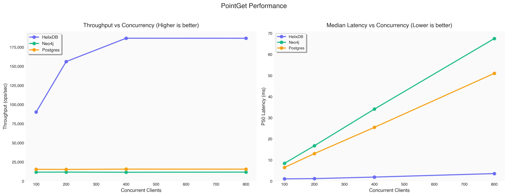
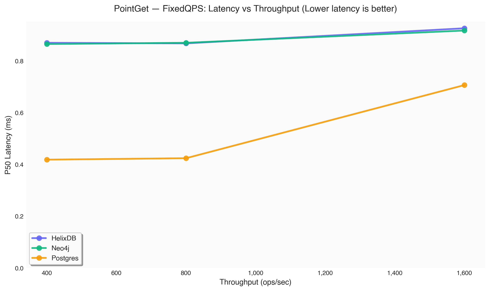
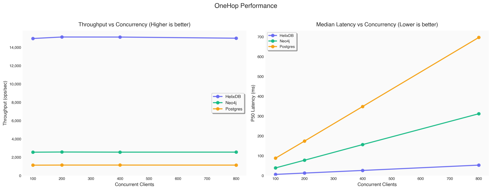
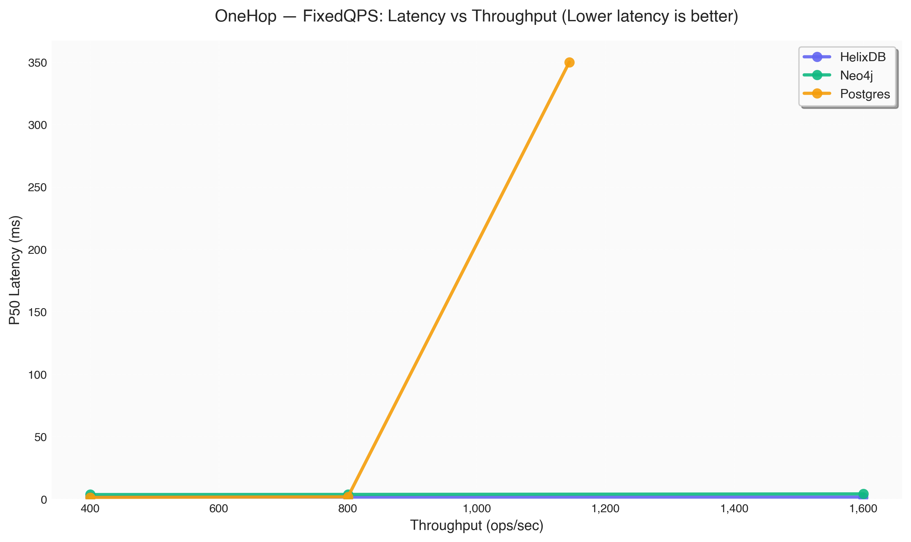
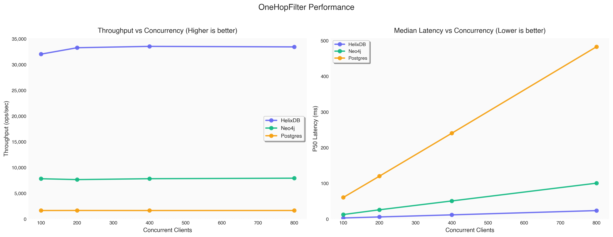
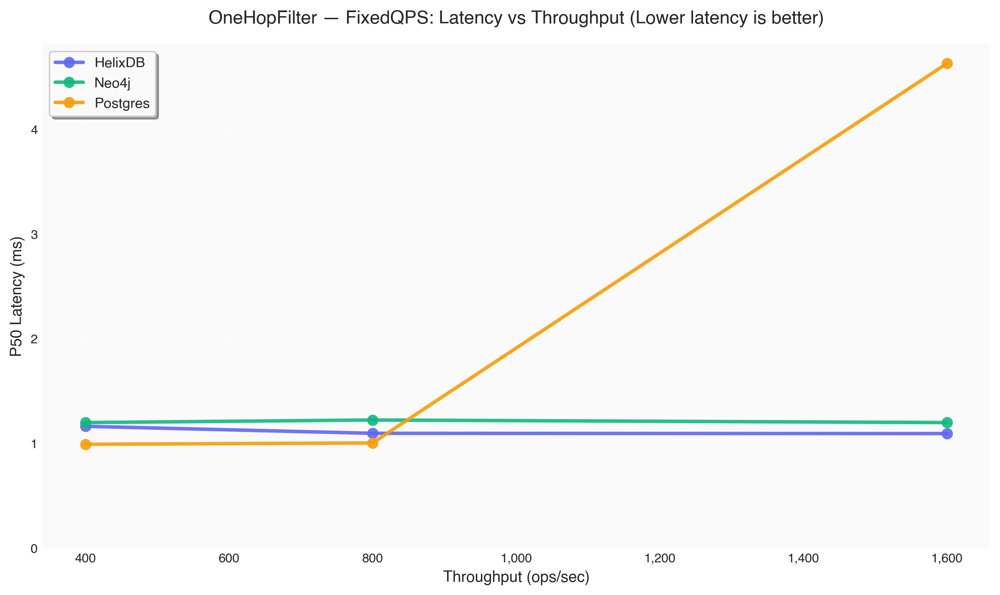

At HelixDB we've been focused on performance for the last few weeks. Here are our benchmarks for **HelixDB**, **Neo4j**, and **Postgres (edges as joins)** on a realistic graph dataset.

We're still working on Vector benchmarks - stay tuned!

> **TL;DR**
>
> _(10,000 users, 500,000 items, ~4M edges)_.
>
> - **HelixDB** crushes graph workloads (5-20x faster) and is your best bet for production graph workloads (GraphRAG, recommendations, social graphs)
> - **Neo4j** 5-20x slower than HelixDB
> - **Postgres** is 10-80x slower
>
> _Dataset hash `ffed7c34a46dc90e` · Conducted November 2025 · [Raw data in repo](https://github.com/helixdb/graph-vector-bench)_

---

## How to Read This

| Term                 | Meaning                                           |
| -------------------- | ------------------------------------------------- |
| **P50 / P95 / P99**  | 50th / 95th / 99th percentile latency             |
| **ops/sec**          | Successful operations per second (throughput)     |
| **FixedConcurrency** | Sustained load at N concurrent clients            |
| **FixedQPS**         | Constant request rate, measures latency stability |

---

## Test Environment

**Hardware:** AWS c6g.2xlarge (eu-west-2) · 8 vCPUs (ARM Neoverse-N1) · 16 GB RAM · 500 GB gp3 EBS

**Software:** Ubuntu 24.04 LTS · HelixDB v2.1.0 · Neo4j 2025.09.0 (G1GC) · PostgreSQL 16.10

**Benchmark:** 2s warmup · 5s measurement window · FixedConcurrency (100/200/400/800) + FixedQPS (400/800/1600)

**Dataset:** 10k users across 25 countries · 500k items across 1k categories · ~4M edges (~400/user)

---

## Workloads Tested

| ID  | Name             | Description                     | Example Use             |
| --- | ---------------- | ------------------------------- | ----------------------- |
| 1   | **PointGet**     | Retrieve entity by ID           | Product detail fetch    |
| 2   | **OneHop**       | Traverse all user -> item edges | Watch history           |
| 3   | **OneHopFilter** | Traverse + filter by category   | "Action movies watched" |

---

## Results Summary

| Workload         | Raw Winner | Performance Gap          |
| ---------------- | ---------- | ------------------------ |
| **PointGet**     | HelixDB    | 12x Postgres, 16x Neo4j  |
| **OneHop**       | HelixDB    | 5.9x Neo4j, 13x Postgres |
| **OneHopFilter** | HelixDB    | 4.2x Neo4j, 20x Postgres |

---
 
## Detailed Results

### 1 · PointGet — Simple ID Lookup

Retrieve single item by ID (product detail, user profile).

**Winner:** HelixDB — 12x Postgres, 16x Neo4j

#### FixedConcurrency Results

| Database | Concurrency | Throughput (ops/sec) | P50 Latency (ms) | P95 Latency (ms) | P99 Latency (ms) |
| -------- | ----------- | -------------------- | ---------------- | ---------------- | ---------------- |
| HelixDB  | 100         | 90,238.4             | 1.07             | 1.29             | 1.41             |
| Neo4j    | 100         | 11,706.0             | 8.43             | 9.11             | 11.30            |
| Postgres | 100         | 15,435.0             | 6.46             | 6.61             | 6.71             |
| HelixDB  | 200         | 156,136.0            | 1.20             | 1.62             | 1.94             |
| Neo4j    | 200         | 11,802.0             | 16.77            | 18.72            | 19.78            |
| Postgres | 200         | 15,307.4             | 13.05            | 13.34            | 13.47            |
| HelixDB  | 400         | 186,642.4            | 1.92             | 2.81             | 3.44             |
| Neo4j    | 400         | 11,592.2             | 34.12            | 37.61            | 38.86            |
| Postgres | 400         | 15,685.6             | 25.47            | 25.86            | 26.16            |
| HelixDB  | 800         | 186,590.8            | 3.57             | 6.73             | 8.62             |
| Neo4j    | 800         | 11,771.8             | 67.52            | 70.90            | 71.72            |
| Postgres | 800         | 15,670.2             | 51.05            | 51.95            | 52.94            |

#### FixedQPS Results

| Database | Target QPS | Actual Throughput (ops/sec) | P50 Latency (ms) | P95 Latency (ms) | P99 Latency (ms) |
| -------- | ---------- | --------------------------- | ---------------- | ---------------- | ---------------- |
| HelixDB  | 400        | 400.2                       | 0.87             | 0.90             | 0.97             |
| Neo4j    | 400        | 400.2                       | 0.87             | 0.91             | 0.93             |
| Postgres | 400        | 400.2                       | 0.42             | 0.44             | 0.46             |
| HelixDB  | 800        | 800.2                       | 0.87             | 0.90             | 0.96             |
| Neo4j    | 800        | 800.2                       | 0.87             | 0.94             | 0.97             |
| Postgres | 800        | 800.0                       | 0.42             | 0.50             | 0.53             |
| HelixDB  | 1600       | 1,600.0                     | 0.93             | 0.99             | 1.10             |
| Neo4j    | 1600       | 1,600.0                     | 0.92             | 0.99             | 1.03             |
| Postgres | 1600       | 1,600.0                     | 0.71             | 1.33             | 1.36             |

---

### 2 · OneHop — Graph Traversal

Fetch all items a user interacted with (~400 edges/user).

**Winner:** HelixDB — 5.9x Neo4j, 13x Postgres

#### FixedConcurrency Results

| Database | Concurrency | Throughput (ops/sec) | P50 Latency (ms) | P95 Latency (ms) | P99 Latency (ms) |
| -------- | ----------- | -------------------- | ---------------- | ---------------- | ---------------- |
| HelixDB  | 100         | 14,964.6             | 6.09             | 11.87            | 15.30            |
| Neo4j    | 100         | 2,555.0              | 38.75            | 42.96            | 46.08            |
| Postgres | 100         | 1,138.2              | 87.84            | 89.38            | 90.38            |
| HelixDB  | 200         | 15,129.2             | 12.72            | 18.74            | 22.21            |
| Neo4j    | 200         | 2,574.0              | 77.53            | 81.04            | 82.36            |
| Postgres | 200         | 1,148.4              | 174.13           | 176.07           | 177.03           |
| HelixDB  | 400         | 15,122.8             | 25.96            | 32.00            | 35.50            |
| Neo4j    | 400         | 2,560.0              | 156.40           | 160.08           | 161.52           |
| Postgres | 400         | 1,148.4              | 348.39           | 350.02           | 351.22           |
| HelixDB  | 800         | 14,996.8             | 52.84            | 58.88            | 62.44            |
| Neo4j    | 800         | 2,562.2              | 311.93           | 317.19           | 318.83           |
| Postgres | 800         | 1,144.6              | 696.85           | 698.79           | 699.19           |

#### FixedQPS Results

| Database | Target QPS | Actual Throughput (ops/sec) | P50 Latency (ms) | P95 Latency (ms) | P99 Latency (ms) |
| -------- | ---------- | --------------------------- | ---------------- | ---------------- | ---------------- |
| HelixDB  | 400        | 400.2                       | 1.70             | 2.51             | 2.65             |
| Neo4j    | 400        | 400.2                       | 3.52             | 3.97             | 4.09             |
| Postgres | 400        | 400.2                       | 1.27             | 1.37             | 1.44             |
| HelixDB  | 800        | 800.2                       | 1.51             | 2.45             | 2.67             |
| Neo4j    | 800        | 800.2                       | 3.62             | 4.19             | 4.72             |
| Postgres | 800        | 800.2                       | 1.70             | 2.70             | 2.84             |
| HelixDB  | 1600       | 1,600.0                     | 1.53             | 2.43             | 2.73             |
| Neo4j    | 1600       | 1,600.2                     | 4.06             | 5.09             | 5.90             |
| Postgres | 1600       | 1,143.8                     | 349.81           | 351.85           | 352.76           |

---

### 3 · OneHopFilter — Filtered Traversal

Find items a user interacted with in a specific category.

**Winner:** HelixDB — 4.2x Neo4j, 20x Postgres

#### FixedConcurrency Results

| Database | Concurrency | Throughput (ops/sec) | P50 Latency (ms) | P95 Latency (ms) | P99 Latency (ms) |
| -------- | ----------- | -------------------- | ---------------- | ---------------- | ---------------- |
| HelixDB  | 100         | 32,030.2             | 2.94             | 5.19             | 7.54             |
| Neo4j    | 100         | 7,826.0              | 12.56            | 14.80            | 16.85            |
| Postgres | 100         | 1,654.4              | 60.44            | 61.32            | 61.61            |
| HelixDB  | 200         | 33,277.0             | 5.84             | 8.96             | 12.93            |
| Neo4j    | 200         | 7,660.2              | 25.87            | 28.49            | 29.41            |
| Postgres | 200         | 1,663.6              | 120.12           | 121.57           | 122.07           |
| HelixDB  | 400         | 33,540.8             | 11.67            | 16.31            | 19.85            |
| Neo4j    | 400         | 7,832.0              | 50.68            | 53.65            | 54.84            |
| Postgres | 400         | 1,653.0              | 240.47           | 254.54           | 256.58           |
| HelixDB  | 800         | 33,438.6             | 23.64            | 28.32            | 32.03            |
| Neo4j    | 800         | 7,935.8              | 100.48           | 104.09           | 105.07           |
| Postgres | 800         | 1,659.8              | 482.84           | 485.47           | 486.47           |

#### FixedQPS Results

| Database | Target QPS | Actual Throughput (ops/sec) | P50 Latency (ms) | P95 Latency (ms) | P99 Latency (ms) |
| -------- | ---------- | --------------------------- | ---------------- | ---------------- | ---------------- |
| HelixDB  | 400        | 400.2                       | 1.16             | 1.21             | 1.23             |
| Neo4j    | 400        | 400.2                       | 1.20             | 1.25             | 1.31             |
| Postgres | 400        | 400.2                       | 0.99             | 1.13             | 1.31             |
| HelixDB  | 800        | 800.2                       | 1.09             | 1.15             | 1.19             |
| Neo4j    | 800        | 800.0                       | 1.22             | 1.28             | 1.32             |
| Postgres | 800        | 800.0                       | 1.00             | 1.62             | 1.67             |
| HelixDB  | 1600       | 1,600.2                     | 1.09             | 1.28             | 1.38             |
| Neo4j    | 1600       | 1,600.0                     | 1.20             | 1.35             | 1.68             |
| Postgres | 1600       | 1,600.0                     | 4.63             | 6.50             | 7.40             |

---

## Performance Highlights

| Database     | Best At          | Latency (P50) |
| ------------ | ---------------- | ------------- |
| **HelixDB**  | Graph operations | 0.9-2.5 ms    |
| **Neo4j**    | Graph operations | 2.0-2.1 ms    |
| **Postgres** | SQL              | 5-40 ms       |

---

## Limitations & Reproducibility

**What we didn't test:**

- Cold-start latency
- Insertion times
- Memory footprint during ingestion
- Operational complexity

**How to reproduce:**

- Dataset hash: `ffed7c34a46dc90e`
- Raw JSON results, configs, and benchmark driver in repo
- Tests: November 2025, AWS c6g.2xlarge (eu-west-2)

---

## The Bottom Line

For **graph workloads** (GraphRAG, Agentic systems, recommendations, social graphs):
-> **Use HelixDB.** The 5-20x graph advantage dominates in real-world scenarios where traversals are frequent.

---

_Benchmark data + scripts: [github.com/helixdb/graph-vector-bench](https://github.com/helixdb/graph-vector-bench)_
