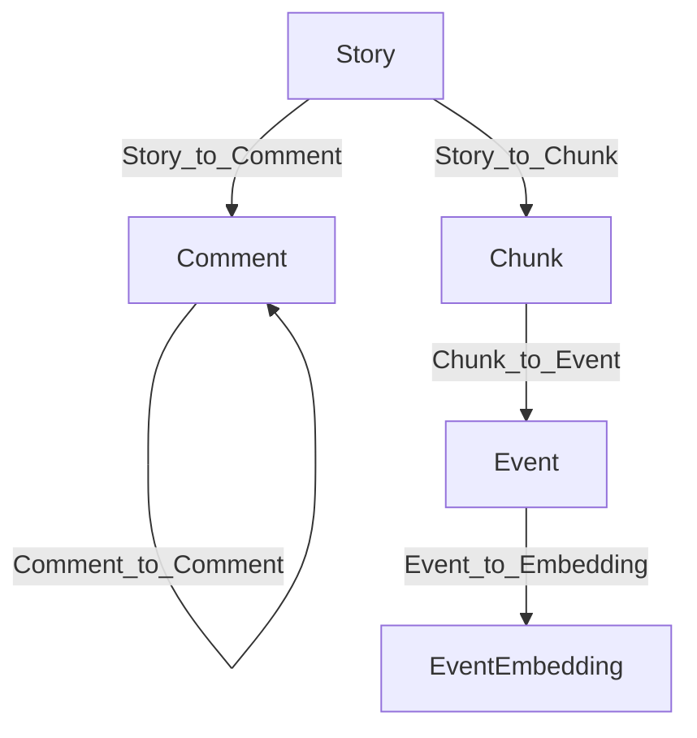
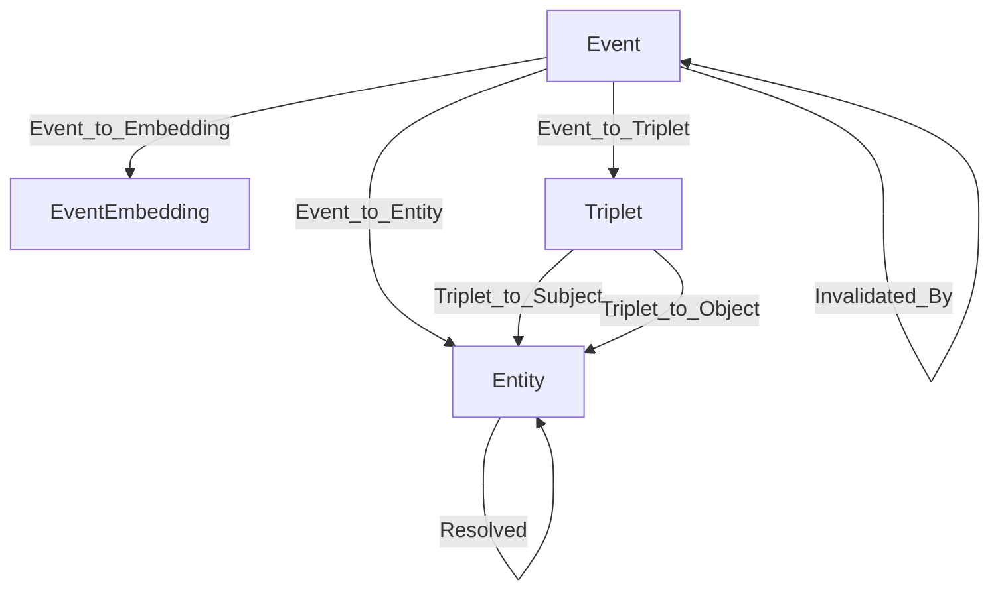

# Introduction

Building a high‑signal knowledge graph out of noisy, fast‑moving discussion data is hard. In this post, I’ll walk through how we built a temporal knowledge graph (KG) from Hacker News using HelixDB and modern LLM agents. HelixDB is the backbone here: a fast, developer‑friendly graph database with native support for vectors and a powerful MCP (Multi‑Context Path) tool layer that lets agents traverse, filter, and collect graph results programmatically. We go end‑to‑end: ingesting raw stories and comments, chunking and extracting time‑aware facts, resolving entities, invalidating contradictions, and retrieving grounded answers through OpenAI agents and a Gemini agent that calls HelixDB’s MCP tools. To make the workflow easy to follow, this post includes concise Python snippets at each stage so you can recreate the pipeline end‑to‑end without hunting through files.

## TLDR

### Knowledge Graph

### HelixDB Agentic Retrieval

## Insights


# Knowledge Graph

This section is inspired by the [Temporal Agents with Knowledge Graphs](https://github.com/openai/openai-cookbook/blob/a90448358320081935df1a133adb8664bbf75047/examples/partners/temporal_agents_with_knowledge_graphs/temporal_agents_with_knowledge_graphs.ipynb) cookbook from OpenAI.

## Graph Architecture

### Data Storage Nodes
- **Story**: the HN submission (uuid, username, title, text, created_at, url, score, klive)
- **Comment**: user replies (uuid, username, text, created_at, parent_uuid, klive)
- **Chunk**: text segments from stories/comments used for extraction (uuid, story_uuid, text, metadata)
- **Event**: a time-aware statement extracted from a chunk (statement, triplets, temporal_type, valid_at/expired_at, invalid_at, invalidated_by)

The edges that connect these nodes are:
- `Story_to_Comment` and `Comment_to_Comment` build the discussion tree
- `Story_to_Chunk` and `Chunk_to_Event` connect raw text to extracted statements



### Knowledge Graph Nodes
- **Triplet**: subject‑predicate‑object facts tied to an Event
- **Entity**: resolved entities (name, entity_type, description, resolved_id)
- **EventEmbedding**: vector representations to enable semantic search

The edges that connect these nodes are:
- `Event_to_Triplet` and `Event_to_Entity` bind statements to their relational and entity structure
- `Event_to_Embedding` and subsequent traversal to structured facts
- `Triplet_to_Subject` / `Triplet_to_Object` link to entity nodes
- `Resolved` captures deduplication across entities
- `Invalidated_By` encodes contradictions between Events



## OpenAI Ingestion

### Hacker News Data Pipeline
We load Hacker News story and comment data with Polars and filter for the last 31 days. For each story we load all of its comments and sub‑comments. Each story becomes a `Story` node and each comment becomes a `Comment` node, preserving the thread structure via `Story_to_Comment` and `Comment_to_Comment` edges.

### Temporal Knowledge Extraction
Stories and their comment threads are processed through a `Chunker` that uses [Chonkie](https://github.com/chonkie-inc/chonkie)'s `RecursiveChunker` with custom rules to split by major sections (STORY vs COMMENTS), individual comments, and subcomments while preserving hierarchical structure. These chunks flow into the `TemporalAgent`, an asynchronous OpenAI-powered extractor (default model: `gpt-5-nano`) that:
1. Extracts candidate statements from each chunk and classifies them as **ATEMPORAL**, **STATIC**, or **DYNAMIC**.
2. Assigns temporal validity ranges (valid_at/expired_at/invalid_at) when text expresses change over time.
3. Converts each statement into `Triplet` facts (subject-predicate-object) and discovers new predicates dynamically.
4. Embeds statements using OpenAI's `text-embedding-3-small` model for vector search.

### Entity Resolution
The `EntityResolution` class handles deduplication of entities that refer to the same real-world concept under different names. It groups entities by type, then uses RapidFuzz's `partial_ratio` with an 90% similarity threshold to cluster similar entities. Within each cluster, it selects the medoid (entity with highest total similarity to others) as the canonical representative. Special acronym detection merges multi-word entities with their acronyms (e.g., "Hacker News" ↔ "HN") using a 98% threshold. All duplicate entities are rewired to point at the canonical node via `Resolved` edges, and triplet references are updated accordingly.
Additionally, a cleanup pass merges acronym/canonical pairs when the acronym match is strong (≥90%) but below the strict 98% rule.

### Knowledge Invalidation
The `InvalidationAgent` maintains temporal consistency by detecting contradictions between events. It processes events in batches, comparing new events against existing ones within the same predicate families using both temporal overlap analysis and embedding similarity. When contradictions are found (e.g., "X acquired Y" vs earlier "X plans to acquire Y"), the agent marks older events as expired or invalid with appropriate timestamps and invalidation relationships. This ensures queries return temporally correct information.

## OpenAI Retrieval
### Planner → Retriever → Answers
The `Planner` agent (default model: `gpt-5-nano`) decomposes the user’s question into targeted steps. It identifies target entities, predicates, and date windows, then produces a structured plan describing which retrieval tool to call and with what arguments.

The `Retriever` agent with GPT-5-mini provides the core retrieval functionality with several key methods:

**Core Retrieval Tools:**
- `factual_qa(entity_name, start_date, end_date, predicate)`: Performs targeted fact retrieval using fuzzy predicate matching (65% similarity threshold) and temporal filtering. Returns grounded chunks, events, and triplets with formatted citations.
- `deep_qa(question, entities, start_date, end_date, predicates)`: Aggregates information across multiple entities and predicates by calling `factual_qa` multiple times, then synthesizes a comprehensive answer using GPT-5-mini.
- `vector_search(query, k=10)`: Uses OpenAI embeddings to find semantically similar events, then formats results with supporting evidence.

**Additional Tools:**
- `search_entities_by_name()`, `search_predicates_by_name()`: Fuzzy search for entities and predicates
- `explore_entity_relationships()`: Discovers connections between entities via triplets
- `list_entities()`, `list_predicates()`: Browse available entities and predicates

The retriever uses fast predicate matching with RapidFuzz, temporal filtering based on event validity ranges, and formats all results with proper citations linking back to source chunks and events.

Behind the scenes, `KGAgent` coordinates the `Planner` and `Retriever` agent with multi‑step plans, calls the right tools, and returns concise, cited answers. The emphasis is on 
determinism and auditability: every answer is backed by concrete Events and Triplets.

```py
from kg_helix.kg_agent import KGAgent
from kg_helix.helix_interface import HelixInterface
from openai import AsyncOpenAI

helix = HelixInterface()
kg_agent = KGAgent(helix=helix, client=AsyncOpenAI(), model="gpt-5-nano")
final_output, tools_used = await kg_agent.run("What is Sam Altman's current job?")
```

## HelixDB Agent Retrieval

We also built a Gemini‑powered agent that uses HelixDB’s MCP tools for fast, dynamic graph traversals. 

### MCP Tools in Practice
The core MCP toolset includes:
- `mcp/init`: Initialize a traversal session
- `mcp/n_from_type`: Seed traversal from nodes of a specific type (e.g., Story, Event)
- `mcp/out_step` / `mcp/in_step`: Follow edges to related nodes (e.g., Embedding → Event → Triplet → Entity → Triplets)
- `mcp/filter_items`: Filter by node properties (timestamps, authors, types)
- `mcp/search_keyword` / `mcp/search_vector`: Lexical and semantic search entry points
- `mcp/collect`: Gather results with optional range limits

In a typical flow, Gemini initializes with `mcp/init`, seeds with `mcp/n_from_type` for specific node types, chains `mcp/out_step` calls to traverse relationships (e.g., Story → Chunk → Event), applies `mcp/filter_items` for temporal or property constraints, and finally `mcp/collect`s the results. Because HelixDB optimizes these graph operations are lightweight and the MCP traversal loop remains responsive for agents to iterate on. See the [MCP guide](https://docs.helix-db.com/guides/mcp-guide) for more details.

## Insights


# HelixDB Agentic Retrieval

## Graph Architecture

On top of the base schema, the agentic layer adds planning and tool‑use. Queries become programs: “seed with stories about X, traverse to Events, filter by date/predicate, collect and summarize.” This yields reproducible retrieval with strong provenance and creates a clean boundary between “what to do” (the plan) and “how to get it done” (HelixDB + MCP tools).

## Agent Architecture

### Supervisor Agent

The supervisor decomposes a user question into steps, selects tools (OpenAI Retriever or MCP traversal), and manages the overall plan, including retry policies for timeouts and fallbacks between keyword and vector search.

### Sub Agent

Specialized sub‑agents execute specific steps—e.g., keyword or vector search, edge traversal, or predicate‑focused factual retrieval—and return structured results that can be directly rendered or further filtered.

### Tool Batching

Where possible, we batch traversal and insertion operations (as shown in the notebooks) to keep latency and cost low without sacrificing recall. The same principle applies to retrieval: fetch compact sets of candidate nodes, then expand where necessary.

## Insights

Agentic retrieval is especially useful for “how did this change over time?” questions, where we need both temporal grounding and precise paths from raw text to extracted facts.

# Future Work

### Retrieval Agents


### Evaluation Framework


## Contributors

