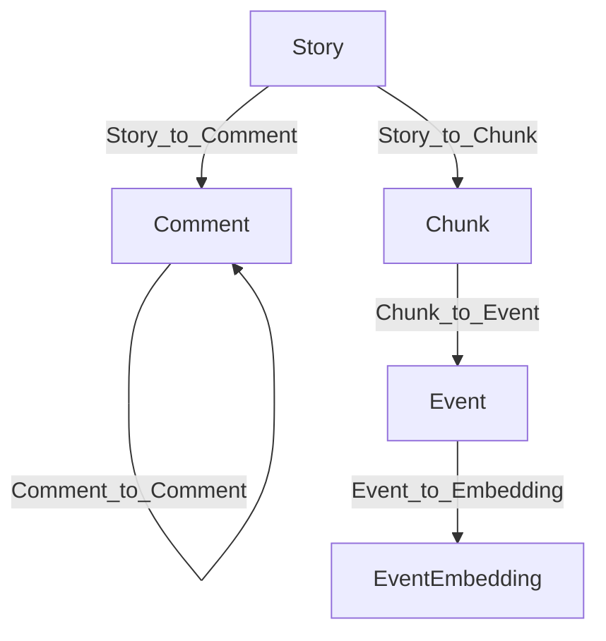
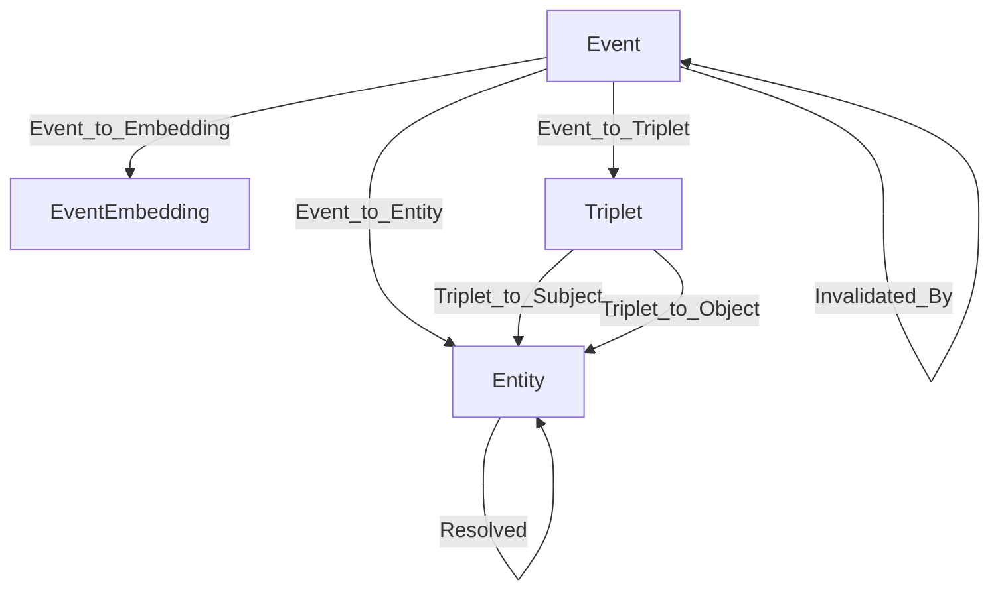
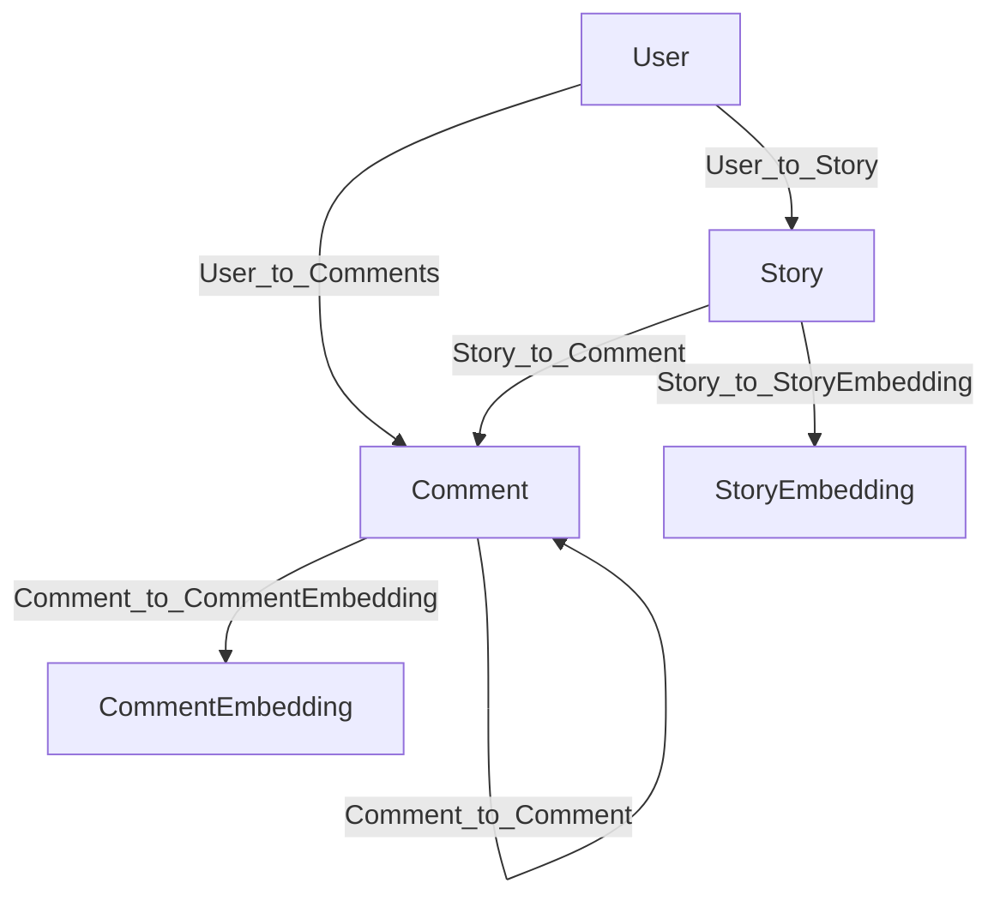

# Introduction

Building a high‑signal knowledge graph out of noisy, fast‑moving discussion data is hard. 
This guide will walk through how we built a temporal knowledge graph from Hacker News using HelixDB and modern LLM agents. 
HelixDB is a powerful and fast graph database with native support for vectors and a powerful MCP tool layer that 
lets agents traverse, filter, and collect graph results programmatically. 
This guide will give you a step‑by‑step walkthrough of ingesting raw stories and comments, 
chunking and extracting time‑aware facts, resolving entities, invalidating contradictions, 
and retrieving grounded answers with OpenAI knowledge graph agents and Gemini agents with HelixDB’s MCP tools.

## TLDR

### Knowledge Graph

### HelixDB Agentic Retrieval

## Insights


---

# Knowledge Graph

This section draws on the excellent [Temporal Agents with Knowledge Graphs](https://github.com/openai/openai-cookbook/blob/a90448358320081935df1a133adb8664bbf75047/examples/partners/temporal_agents_with_knowledge_graphs/temporal_agents_with_knowledge_graphs.ipynb) notebook from OpenAI. However, our implementation differs substantially in both schema design and storage architecture. Whereas the original example relies on a Postgres instance paired with a separate vector store, we use **HelixDB**'s hybrid graph-and-vector model which eliminates the operational overhead of orchestrating multiple databases.

## Graph Architecture

### Data Storage Nodes
- **Story**: the HN submission (uuid, username, title, text, created_at, url, score, klive)
- **Comment**: user replies (uuid, username, text, created_at, parent_uuid, klive)
- **Chunk**: text segments from stories/comments used for extraction (uuid, story_uuid, text, metadata)
- **Event**: a time-aware statement extracted from a chunk (statement, triplets, temporal_type, valid_at/expired_at, invalid_at, invalidated_by)

The relationships between these nodes are captured by the following edge types:
- `Story_to_Comment` and `Comment_to_Comment` build the discussion tree
- `Story_to_Chunk` and `Chunk_to_Event` connect raw text to extracted statements



### Knowledge Graph Nodes
- **Triplet**: subject‑predicate‑object facts tied to an Event
- **Entity**: resolved entities (name, entity_type, description, resolved_id)
- **EventEmbedding**: vector representations to enable semantic search

The edges that connect these nodes are:
- `Event_to_Triplet` and `Event_to_Entity` bind statements to their relational and entity structure
- `Event_to_Embedding` and subsequent traversal to structured facts
- `Triplet_to_Subject` / `Triplet_to_Object` link to entity nodes
- `Resolved` captures deduplication across entities
- `Invalidated_By` encodes contradictions between Events



---

## OpenAI Ingestion

### Hacker News Data Pipeline
We ingest Hacker News submissions and comments with Polars, restricting the dataset to the most recent 31 days. Each submission is stored as a `Story` node, while every reply—regardless of nesting depth—is represented as a `Comment` node, while preserving the hierarchical structure through `Story_to_Comment` and `Comment_to_Comment` edges.

### Temporal Knowledge Extraction
The combined story–comment threads are processed through a custom `Chunker` built on [Chonkie](https://github.com/chonkie-inc/chonkie)'s `RecursiveChunker`. Our rules partition text along major structural boundaries (stories, comments, sub-comments). Resulting chunks are passed to the **TemporalAgent** (default model: `gpt-5-nano`), which:
1. Detects candidate events and classifies each as **ATEMPORAL**, **STATIC**, or **DYNAMIC**.
2. Generates vector embeddings of the events via OpenAI's `text-embedding-3-small` model.
3. Assigns temporal validity ranges (`valid_at`, `expired_at`, `invalid_at`) when the text indicates change over time.
4. Extracts entities and subject‑predicate‑object triplets, selecting predicates from `predicates.csv` or creating new ones when necessary.

### Entity Resolution
The **EntityResolution** class handles deduplication of entities that refer to the same real-world concept under different names. 
Entities are grouped by type, and **RapidFuzz**’s `partial_ratio` (≥ 90 % similarity) identifies candidate clusters. 
Within each cluster we select the **medoid**,the entity whose aggregate similarity to peers is maximal, as the canonical representative. 
Then the acronym detection merges multi-word entities with their abbreviations (e.g., "Hacker News" ↔ "HN") at a stricter 98 % threshold. 
All duplicates are then rewired to the canonical node via `Resolved` edges andtheir references in triplets are updated accordingly. 
Finally, a secondary pass reconciles high-confidence (≥ 90 %) acronym pairs that fell below the primary cutoff.

### Knowledge Invalidation
The **InvalidationAgent** enforces temporal consistency by detecting contradictions between events. Incoming events are batched and compared against historical events sharing the same predicate family. We combine temporal-range intersection with embedding similarity to flag conflicts (e.g., "X acquired Y" vs. the earlier "X plans to acquire Y"). Superseded events are marked `expired` or `invalid`, and linked via `Invalidated_By` edges so that queries only return the chronologically accurate facts.

---

## KG Agent Retrieval

The **Knowledge Graph Agent** adapts the retrieval algorithms presented in OpenAI’s cookbook, but operates directly on HelixDB’s unified storage layer. Consequently, the agent interacts with a single backend instead of managing separate Postgres and vector store instances. We also added additional retrieval tools to the agent to improve the quality of the retrieved results, such as entity and predicate lookup tools and vector search tools.

### Planner → Retriever → Answer
1. **Planner** (`gpt-5-nano`) decomposes the user’s question and identifies target entities, predicates, and temporal windows. It generates a structured plan specifying which retrieval tool to invoke and with which parameters.
2. **Retriever** (`gpt-5-mini`) executes the plan using the methods below.

**Primary Retrieval Methods**
- `factual_qa(entity_name, start_date, end_date, predicate)`: Performs focused fact-finding with fuzzy predicate matching (≥ 65 % similarity) and temporal filters. Returns grounded chunks, events, and triplets.
- `deep_qa(question, entities, start_date, end_date, predicates)`: Aggregates results across multiple entities/predicates by invoking `factual_qa` iteratively, then synthesises a holistic answer.
- `vector_search(query, k=10)`: Uses embeddings generated from the query text to retrieve semantically similar events.

**Additional Tools**
- `search_entities_by_name`, `search_predicates_by_name`: Fuzzy lookup tools to find entities and predicates by name.
- `explore_entity_relationships`: Discovers multihop connections between entities.
- `list_entities`, `list_predicates`: Enumeration tools to browse the graph.

Internally, predicate matching leverages **RapidFuzz**, temporal filtering constrains results to valid intervals, and every answer is accompanied by machine-readable citations linking back to source chunks.

`KGAgent` orchestrates the **Planner** and **Retriever**, executes the necessary tool calls, and returns concise, auditable answers.

Below is a snippet of the `KGAgent` used to answer the question "What is Sam Altman's current job?".

```py
from kg_helix.kg_agent import KGAgent
from kg_helix.helix_interface import HelixInterface
from openai import AsyncOpenAI

helix = HelixInterface()
kg_agent = KGAgent(helix=helix, client=AsyncOpenAI(), model="gpt-5-nano")
final_output, tools_used = await kg_agent.run("What is Sam Altman's current job?")
```

---

## HelixDB Agent Retrieval

Because our data resides natively in **HelixDB**, we can use its built-in MCP endpoints to directly traverse the graph inside the database. 
Leveraging these endpoints, we implemented a Gemini-powered retrieval agent that performs low-latency, dynamic graph exploration via these MCP tools.
The reason behind using Gemini instead of OpenAI is because Gemini is faster and more cost-effective with tool calls.

### MCP Tools in Practice
The core MCP toolset includes:
- `mcp/init`: Initialize a traversal session
- `mcp/n_from_type`: Seed traversal from nodes of a specific type (e.g., Story, Event)
- `mcp/out_step` / `mcp/in_step`: Follow edges to related nodes (e.g., Embedding → Event → Triplet → Entity → Triplets)
- `mcp/filter_items`: Filter by node properties (timestamps, authors, types)
- `mcp/search_keyword` / `mcp/search_vector`: Lexical and semantic search entry points
- `mcp/collect`: Gather results with optional range limits

In a typical session Gemini:
1. initializes a traversal session with `mcp/init`
2. starts the traversal by getting nodes of a specific type with `mcp/n_from_type` (e.g., `Story`, `Event`)
3. chains `mcp/out_step` / `mcp/in_step` calls to follow relationships (e.g., `Story → Chunk → Event → Triplet → Entity`)
4. applies `mcp/filter_items` to filter by temporal or property constraints
5. finalizes the query with `mcp/collect`, optionally limiting result counts

HelixDB’s MCP tools ensure that the traversal loop remains stateful as the agent iterates on intermediate results.
See the [MCP guide](https://docs.helix-db.com/guides/mcp-guide) for further details.

## Conclusion

TBD (something about predefined algorithms vs agentic retrieval)

---

# HelixDB Agentic Retrieval

This section demonstrates how HelixDB can power a *domain-specific* graph focused on Hacker News discussions. 
Instead of storing knowledge as general entities and triplets, it is stored in domain specific objects, 
which in this case are **stories**, **comments**, and **users**, with some objects having Gemini embeddings for semantic search.  

## Graph Architecture

### Nodes
- **Story**: the HN submission (uuid, username, title, text, created_at, url, score, klive)
- **Comment**: user replies (uuid, username, text, created_at, parent_uuid, klive)
- **User**: a user of the platform (username, created_at)
- **StoryEmbedding**: vector representations for stories
- **CommentEmbedding**: vector representations for comments

The relationships between these nodes are captured by the following edge types:
- `Story_to_Comment` and `Comment_to_Comment` build the discussion tree
- `User_to_Story` and `User_to_Comments` connect users to their stories and comments
- `Story_to_StoryEmbedding` and `Comment_to_CommentEmbedding` connect stories and comments to their vector representations



## Ingestion Pipeline

TBD

---

## Agent Architecture

In this section, we improved the retrival agent architecture by introducing a supervisor agent.
Along with the supervisor agent, the sub agents can leverage HelixDB's MCP tools to traverse the graph efficiently.

### Supervisor Agent

The supervisor agent interprets the user’s query and formulates a high-level execution plan that may require several traversal patterns. 
It then instantiates specialized sub-agents, each equipped with the full MCP toolset, to carry out individual segments of the plan. 
This design enables follow-up questions to build seamlessly on prior results. 
The supervisor also oversees error handling and dynamically replans any incomplete tasks to ensure continuous progress.

### Sub Agent

Sub-agents execute the traversal steps defined in the supervisor’s plan. 
We will be using Gemini to power the sub agent because it is faster and more cost-effective with tool calls.
While they have access to all the MCP tools, we introduced an additional batch capability to speed up common traversal patterns and reduce costs. 
The batch tool lets a sub-agent execute multiple MCP calls in a single operation, after which it can iteratively refine the results with targeted MCP queries.

## Conclusion

TBD

---

# Future Work

### Retrieval Agents

TBD

### Evaluation Framework

TBD

## Contributors
- [name](link)