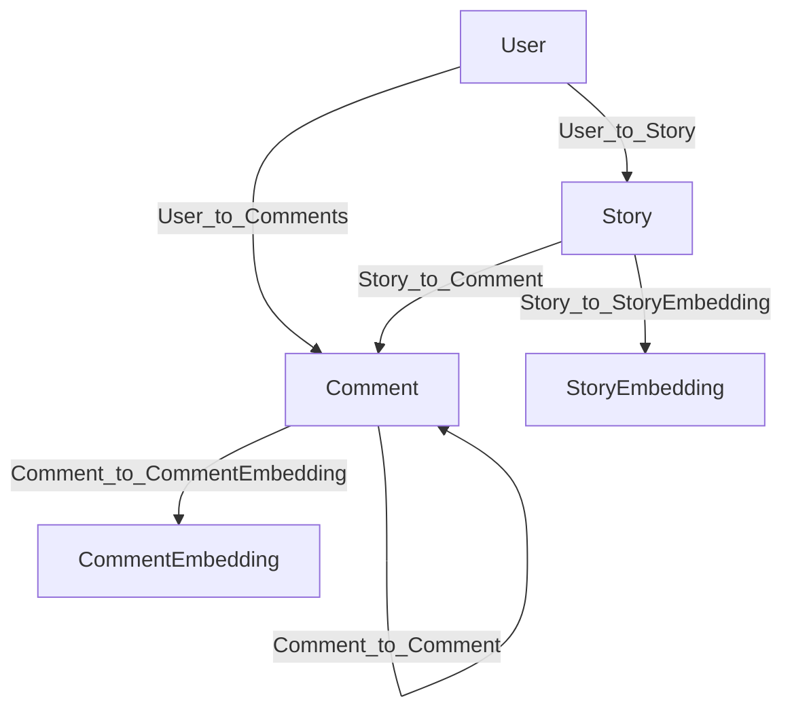

# Introduction

Building a high‑signal knowledge graph out of noisy, fast‑moving discussion data is hard. 
This guide will walk through how we built a domain-specific knowledge graph from Hacker News using HelixDB and modern LLM agents. 
HelixDB is a powerful and fast graph database with native support for vectors and a powerful MCP tool layer that 
lets agents traverse, filter, and collect graph results programmatically. 

This guide will give you a step‑by‑step walkthrough of the overall process of ingesting posts and comments and then 
retrieving grounded answers using a multi-agent retrieval system with HelixDB’s MCP tools.

### TL;DR
> **Domain-Specific Knowledge Graph** - _Use HelixDB as graph and vector storage for a Hacker News posts and comments temporal knowledge graph.
> Use HelixDB’s native MCP tools plus a Gemini-powered supervisor–sub-agent hierarchy for 
> agentic retrieval over a domain-specific Hacker News knowledge graph. Stories, comments, and users are stored directly with vector embeddings. 
> A supervisor agent orchestrates the retrieval process, spawning Gemini-powered sub-agents to traverse, search, and filter the graph inside the database. 
> Sub-agents have access to batch MCP call tools to perform common traversal operations in batches, with fallback to individual MCP call tools.
> Advantages over traditional knowledge graph agents include improved speed, reliability, and flexibility
> Batch MCP operations with intelligent fallbacks deliver both performance optimization and robust error recovery._

# Agentic Retrieval with HelixDB

This section demonstrates how **HelixDB** can power a *domain-specific* graph focused on Hacker News discussions. 
Instead of storing knowledge as general entities and triplets, it is stored in domain specific objects, 
which in this case are **stories**, **comments**, and **users**, with some objects having Gemini embeddings for semantic search.  

## Graph Architecture

### Nodes
- **Story**: the HN submission (uuid, username, title, text, created_at, url, score, klive)
- **Comment**: user replies (uuid, username, text, created_at, parent_uuid, klive)
- **User**: a user of the platform (username, created_at)
- **StoryEmbedding**: vector representations for stories
- **CommentEmbedding**: vector representations for comments

The relationships between these nodes are captured by the following edge types:
- `Story_to_Comment` and `Comment_to_Comment` build the discussion tree
- `User_to_Story` and `User_to_Comments` connect users to their stories and comments
- `Story_to_StoryEmbedding` and `Comment_to_CommentEmbedding` connect stories and comments to their vector representations

## Ingestion Pipeline

The ingestion pipeline processes 20 filtered Hacker News stories and their comments through a streamlined four-stage process that transforms the data into a queryable graph structure with semantic search capabilities.
However, in our demo, we ingested around 288,000 stories and 1.3 million comments (including sub-comments) with Gemini embeddings.

### Data Loading and Filtering
Using **Polars** for efficient data manipulation, we load the raw Hacker News dataset apply temporal and quality filters:
- **Temporal Filter**: Select stories from the most recent 150 days to focus on current discussions
- **Quality Filter**: Include only stories with scores > 100 to ensure high-engagement content
- **Hierarchical Extraction**: Extract parent comments (directly replying to stories) and sub-comments (replies to comments) to preserve discussion structure

### Data Cleaning and Normalization
- **HTML Sanitization**: Remove HTML tags and decode entities
- **Timestamp Standardization**: Convert time strings to ISO format with UTC timezone
- **User Deduplication**: Extract unique usernames across stories, comments, and sub-comments

### Vector Embedding Generation
Text content is converted to high-dimensional vectors for semantic search using **Gemini's embedding model**:
- **Content Preparation**: Combined titles and text for story nodes and use comment text directly for comment nodes
- **Embedding Generation**: Generate vectors optimized for document retrieval with Gemini's embedding model

### Graph Database Insertion
Structured data and embeddings are inserted into **HelixDB** using predefined queries that automatically establish relationships:
1. **User Nodes**: Insert unique users first to establish identity references
2. **Story Insertion**: Create story nodes with metadata, link to users via `User_to_Story` edges, and connect to vector embeddings via `Story_to_StoryEmbedding` edges
3. **Comment Hierarchy**: Insert parent and sub-comments with `parent_uuid` references, establishing `Story_to_Comment` and `Comment_to_Comment` relationships
4. **Comment Embeddings**: Insert comment and sub-comment embeddings and connect to comment nodes via `Comment_to_CommentEmbedding` edges

---

## Agent Architecture

The retrieval system introduces a **supervisor-sub agent** architecture powered by **Gemini 2.5 Flash** models, 
where a coordinator agent spawns specialized sub-agents to execute complex graph traversals using HelixDB's native MCP tools.

### Supervisor Agent

The **SupervisorAgent** (`gemini-2.5-flash`) acts as a high-level coordinator that:
- **Query Decomposition**: Analyzes user queries and determines whether to spawn single or multiple sub-agents based on complexity
- **Parallel Execution**: Spawns multiple sub-agents for complex queries requiring different perspectives
- **Result Synthesis**: Aggregates results from all sub-agents and provides comprehensive summaries
- **Error Handling**: Manages sub-agent failures and coordinates retry logic

The supervisor has two primary tools:
- `spawn_sub_agent(instruction)`: Creates a single sub-agent for focused queries
- `spawn_multiple_sub_agents(instructions)`: Spawns multiple sub-agents in parallel for multi-faceted queries

### Sub Agent

**SubAgents** (`gemini-2.5-flash-lite`) are specialized execution units that perform the actual graph traversals. Each sub-agent:

**Core MCP Capabilities**:      
Because our data resides natively in **HelixDB**, we can use its built-in MCP endpoints to directly traverse the graph inside the database. 
Leveraging these endpoints, we implemented a Gemini-powered retrieval agent that performs low-latency, dynamic graph exploration via these MCP tools:

- `mcp/init`: Initialize a traversal session
- `mcp/n_from_type`: Seed traversal from nodes of a specific type (e.g., Story, Comment)
- `mcp/out_step` / `mcp/in_step`: Follow edges to related nodes (e.g., Embedding → Comment → Story)
- `mcp/filter_items`: Filter by node properties (timestamps, authors, types)
- `mcp/search_keyword` / `mcp/search_vector`: Lexical and semantic search entry points
- `mcp/collect`: Gather results with optional range limits

In a typical session Gemini:
1. Initializes a traversal session with `mcp/init`
2. Starts the traversal by getting nodes of a specific type with `mcp/n_from_type` (e.g., `Story`, `Comment`)
3. Chains `mcp/out_step` / `mcp/in_step` calls to follow relationships (e.g., `Story → Comment`)
4. Applies `mcp/filter_items` to filter by temporal or property constraints
5. Finalizes the query with `mcp/collect`, optionally limiting result counts

HelixDB’s MCP tools ensure that the traversal loop remains stateful as the agent iterates on intermediate results.
See the [MCP guide](https://docs.helix-db.com/guides/mcp-guide) for further details.

**Batch Optimization**:
The key innovation is `mcp_run_batch_tools`, which executes multiple MCP operations in a single call:
- **Connection Management**: Automatically handles `connection_id` propagation across batch operations
- **Error Recovery**: Falls back to individual MCP calls if batch execution fails
- **State Preservation**: Uses `drop=false` to maintain traversal state for iterative refinement

**Intelligent Retry Logic**:
Sub-agents implement aggressive retry behavior—if batch operations return empty results, they automatically retry using individual MCP calls, ensuring robust query execution even when complex batch operations fail.

This architecture enables **dynamic query planning** where agents compose graph operations on the fly, providing both the performance benefits of batch operations and the reliability of individual tool fallbacks.

## Conclusion

The agentic retrieval approach demonstrates significant advantages over traditional knowledge graph extraction pipelines. By storing domain-specific objects (stories, comments, users) rather than traditional entities and triplets, we eliminate the complexity of knowledge extraction, entity resolution, and contradiction detection while maintaining rich semantic relationships.

The supervisor-sub agent architecture scales retrieval operations through parallel execution and intelligent workload distribution. Sub-agents leverage HelixDB's native MCP tools to perform stateful graph traversals directly in the database, avoiding the overhead of external coordination between multiple storage systems.

The key innovation is the batch MCP operations tool with automatic fallback to individual tools, which provides both performance optimization for common traversal patterns and robust error recovery for complex queries. This dual-mode execution ensures reliable results even when sophisticated batch operations encounter tool errors or data inconsistencies.

Operationally, this approach reduces the engineering complexity of maintaining traditional ingestion pipelines of chunking, embedding, entity extraction, and fact validation. The streamlined four-stage pipeline (load → clean → embed → insert) processes millions of records efficiently while preserving discussion hierarchies and semantic relationships.

The domain-specific design, when compared to traditional knowledge graph designs, trades some generalizability for substantial improvements in query performance, system reliability, and operational simplicity, making it ideal for focused applications where speed and accuracy matter more than broad knowledge representation.

---

# Future Work

### Retrieval Agents

Despite its strong performance within the Hacker News domain, our current agentic retrieval and ingestion layer is intentionally specialized. Traversal prompts, batch operations, and schema assumptions are tightly coupled to a fixed set of node and edge types. In the future, we will make this layer more dynamic so that agents can automatically adapt to different knowledge domains.

Another interesting direction is to design an **agentic ingestion pipeline** that keeps the graph fresh in near-real-time.

A dedicated ingestion-supervisor agent will:
1. Maintain a holistic view of the data
2. Discover new facts, entities, and relationships
3. Propose node and edge definitions (including property names, data types, and vector embedding policies)
4. Deploy the schema to HelixDB

Once the schema has been deployed, the supervisor will delegate the workload across ingestion sub-agents running in parallel. 

Each sub-agent will:
1. Traverse the live graph with MCP tools to locate the insertion points (e.g. using similarity search to find exising or related nodes/edges)
2. Detect duplicates and contradictions and adjusting the insertion plan accordingly
3. Insert new nodes, edges, and embeddings into the graph

Because sub-agents operate inside the same MCP session, they benefit from real-time visibility into data inserted by other sub-agents. This immediate feedback loop eliminates the need for reconciliation algorithms and ensures that the graph remains consistent even under high ingestion throughput. Monitoring and anomaly detection tools will also be added to the supervisor to detect and handle errors in the ingestion pipeline.

Looking further ahead, we envision deeper **multi-layer agent hierarchies**. Planner agents could decompose complex analytical questions into sub-tasks for domain-specific retrieval agents. Ranking agents could re-score intermediate results. Summarisation agents could process many pieces of evidence into concise answers. This modular architecture will allow us to scale to larger graphs and more sophisticated reasoning, all while preserving the real-time performance and operational simplicity that HelixDB’s in-database MCP tooling provides.