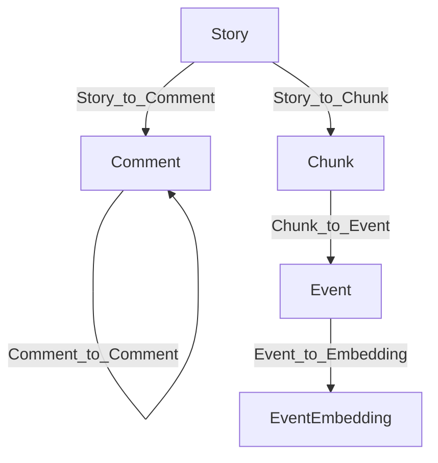
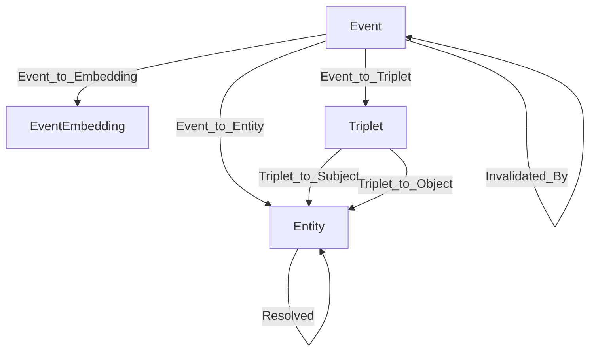
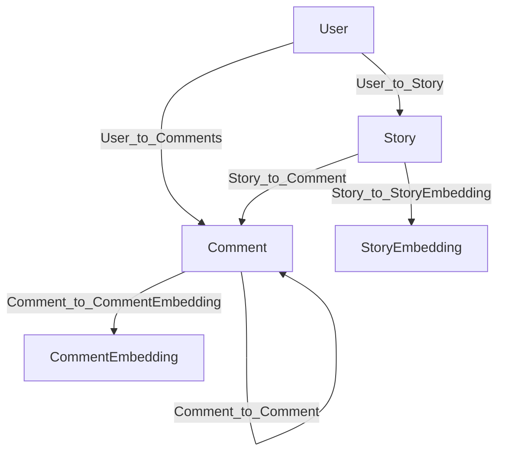

# Introduction

Building a high‑signal knowledge graph out of noisy, fast‑moving discussion data is hard. 
This guide will walk through how we built a temporal knowledge graph from Hacker News using HelixDB and modern LLM agents. 
HelixDB is a powerful and fast graph database with native support for vectors and a powerful MCP tool layer that 
lets agents traverse, filter, and collect graph results programmatically. 

This guide will give you a step‑by‑step walkthrough of the overall process of ingesting posts and comments, 
chunking them, extracting temporal facts and entities, resolving entity conflicts, invalidating contradictions, 
and retrieving grounded answers with OpenAI knowledge graph agents and Gemini agents with HelixDB’s MCP tools.

### TL;DR
> **General Knowledge Graph** - _Use HelixDB as graph and vector storage for a Hacker News posts and comments temporal knowledge graph. 
> A GPT-driven pipeline extracts events, entities, facts, and embeddings, resolves duplicates, and invalidates contradictions. 
> Queries are answered via two agents: (1) an OpenAI tool-based KGAgent for scoped factual Q&A and 
> (2) a Gemini-powered MCP agent that performs fast, flexible in-database graph traversals. 
> The MCP approach is faster and more adaptable, and the OpenAI agent provides stricter guardrails for more focused queries. 
> Use the MCP approach for open-ended questions, multi-hop reasoning, and investigative workflows._

> **Agentic Retrieval with HelixDB** - _Use HelixDB’s native MCP tools plus a Gemini-powered supervisor–sub-agent hierarchy for 
> agentic retrieval over a domain-specific Hacker News graph. Stories, comments, and users are stored directly with vector embeddings. 
> A supervisor agent orchestrates the retrieval process, spawning Gemini-powered sub-agents to traverse, search, and filter the graph inside the database. 
> Sub-agents have access to batch MCP call tools to perform common traversal operations in batches, with fallback to individual MCP call tools.
> Improved reliability and performance over the original MCP approach mentioned above._

---

# General Knowledge Graph

This section draws on the excellent [Temporal Agents with Knowledge Graphs](https://github.com/openai/openai-cookbook/blob/a90448358320081935df1a133adb8664bbf75047/examples/partners/temporal_agents_with_knowledge_graphs/temporal_agents_with_knowledge_graphs.ipynb) notebook from OpenAI. However, our implementation differs substantially in both schema design and storage architecture. Whereas the original example relies on a Postgres instance paired with a separate vector store, we use **HelixDB**'s hybrid graph-and-vector model which eliminates the operational overhead of orchestrating multiple databases.

## Graph Architecture

### Data Storage Nodes
- **Story**: the HN submission (uuid, username, title, text, created_at, url, score, klive)
- **Comment**: user replies (uuid, username, text, created_at, parent_uuid, klive)
- **Chunk**: text segments from stories/comments used for extraction (uuid, story_uuid, text, metadata)
- **Event**: a time-aware statement extracted from a chunk (statement, triplets, temporal_type, valid_at/expired_at, invalid_at, invalidated_by)

The relationships between these nodes are captured by the following edge types:
- `Story_to_Comment` and `Comment_to_Comment` build the discussion tree
- `Story_to_Chunk` and `Chunk_to_Event` connect raw text to extracted statements



### Knowledge Graph Nodes
- **Triplet**: subject‑predicate‑object facts tied to an Event
- **Entity**: resolved entities (name, entity_type, description, resolved_id)
- **EventEmbedding**: vector representations to enable semantic search

The edges that connect these nodes are:
- `Event_to_Triplet` and `Event_to_Entity` bind statements to their relational and entity structure
- `Event_to_Embedding` and subsequent traversal to structured facts
- `Triplet_to_Subject` / `Triplet_to_Object` link to entity nodes
- `Resolved` captures deduplication across entities
- `Invalidated_By` encodes contradictions between Events



---

## OpenAI Ingestion

### Hacker News Data Pipeline
We ingest Hacker News posts and comments using Polars to load and manipulate the data, restricting the dataset to the most recent 31 days and take the latest 150 posts and its comments. Each post is stored as a `Story` node, while every comment, regardless of nesting depth, is represented as a `Comment` node. The hierarchical structure is represented through `Story_to_Comment` and `Comment_to_Comment` edges.

### Temporal Knowledge Extraction
The combined story–comment threads are processed through a custom `Chunker` built on [Chonkie](https://github.com/chonkie-inc/chonkie)'s `RecursiveChunker`. Our rules partition text along major structural boundaries (stories, comments, sub-comments). Resulting chunks are passed to the **TemporalAgent** (default model: `gpt-5-nano`), which:
1. Detects candidate events and classifies each as **ATEMPORAL**, **STATIC**, or **DYNAMIC**.
2. Generates vector embeddings of the events via OpenAI's `text-embedding-3-small` model.
3. Assigns temporal validity ranges (`valid_at`, `expired_at`, `invalid_at`) when the text indicates change over time.
4. Extracts entities and subject‑predicate‑object triplets, selecting predicates from `predicates.csv` or creating new ones when necessary.

### Entity Resolution
The **EntityResolution** class handles deduplication of entities that refer to the same real-world concept under different names. 
Entities are grouped by type, and **RapidFuzz**’s `partial_ratio` (≥ 90 % similarity) identifies candidate clusters. 
Within each cluster we select the **medoid**,the entity whose aggregate similarity to peers is maximal, as the canonical representative. 

Then the acronym detection merges multi-word entities with their abbreviations (e.g., "Hacker News" ↔ "HN") at a stricter 98 % threshold. 
All duplicates are then rewired to the canonical node via `Resolved` edges andtheir references in triplets are updated accordingly. 
Finally, a secondary pass reconciles high-confidence (≥ 90 %) acronym pairs that fell below the primary cutoff.

### Knowledge Invalidation
The **InvalidationAgent** enforces temporal consistency by detecting contradictions between events. Incoming events are batched and compared against historical events sharing the same predicate family. We combine temporal-range intersection with embedding similarity to flag conflicts (e.g., "X acquired Y" vs. the earlier "X plans to acquire Y"). Superseded events are marked `expired` or `invalid`, and linked via `Invalidated_By` edges so that queries only return the chronologically accurate facts.

---

## OpenAI Agent Retrieval

The **Knowledge Graph Agent** adapts the retrieval algorithms presented in OpenAI’s cookbook, but operates directly on HelixDB’s unified storage layer. Consequently, the agent interacts with a single backend instead of managing separate Postgres and vector store instances. We also added additional retrieval tools to the agent to improve the quality of the retrieved results, such as entity and predicate lookup tools and vector search tools.

### Planner → Retriever → Answer
1. **Planner** (`gpt-5-nano`) decomposes the user’s question and identifies target entities, predicates, and temporal windows. It generates a structured plan specifying which retrieval tool to invoke and with which parameters.
2. **Retriever** (`gpt-5-mini`) executes the plan using the methods below.

**Primary Retrieval Methods**
- `factual_qa(entity_name, start_date, end_date, predicate)`: Performs focused fact-finding with fuzzy predicate matching (≥ 65 % similarity) and temporal filters. Returns grounded chunks, events, and triplets.
- `deep_qa(question, entities, start_date, end_date, predicates)`: Aggregates results across multiple entities/predicates by invoking `factual_qa` iteratively, then synthesises a holistic answer.
- `vector_search(query, k=10)`: Uses embeddings generated from the query text to retrieve semantically similar events.

**Additional Tools**
- `search_entities_by_name`, `search_predicates_by_name`: Fuzzy lookup tools to find entities and predicates by name.
- `explore_entity_relationships`: Discovers multihop connections between entities.
- `list_entities`, `list_predicates`: Enumeration tools to browse the graph.

Internally, predicate matching leverages **RapidFuzz**, temporal filtering constrains results to valid intervals, and every answer is accompanied by machine-readable citations linking back to source chunks.

`KGAgent` orchestrates the **Planner** and **Retriever**, executes the necessary tool calls, and returns concise, auditable answers.

Below is a snippet of the `KGAgent` used to answer the question "What is Sam Altman's current job?".

```py
from kg_helix.kg_agent import KGAgent
from kg_helix.helix_interface import HelixInterface
from openai import AsyncOpenAI

helix = HelixInterface()
kg_agent = KGAgent(helix=helix, client=AsyncOpenAI(), model="gpt-5-nano")
final_output, tools_used = await kg_agent.run("What is Sam Altman's current job?")
```

---

## HelixDB MCP Agent Retrieval

Because our data resides natively in **HelixDB**, we can use its built-in MCP endpoints to directly traverse the graph inside the database. 
Leveraging these endpoints, we implemented a Gemini-powered retrieval agent that performs low-latency, dynamic graph exploration via these MCP tools.
The reason behind using Gemini instead of OpenAI is because Gemini is faster and more cost-effective with tool calls.

### MCP Tools in Practice
The core MCP toolset includes:
- `mcp/init`: Initialize a traversal session
- `mcp/n_from_type`: Seed traversal from nodes of a specific type (e.g., Story, Event)
- `mcp/out_step` / `mcp/in_step`: Follow edges to related nodes (e.g., Embedding → Event → Triplet → Entity → Triplets)
- `mcp/filter_items`: Filter by node properties (timestamps, authors, types)
- `mcp/search_keyword` / `mcp/search_vector`: Lexical and semantic search entry points
- `mcp/collect`: Gather results with optional range limits

In a typical session Gemini:
1. Initializes a traversal session with `mcp/init`
2. Starts the traversal by getting nodes of a specific type with `mcp/n_from_type` (e.g., `Story`, `Event`)
3. Chains `mcp/out_step` / `mcp/in_step` calls to follow relationships (e.g., `Story → Chunk → Event → Triplet → Entity`)
4. Applies `mcp/filter_items` to filter by temporal or property constraints
5. Finalizes the query with `mcp/collect`, optionally limiting result counts

HelixDB’s MCP tools ensure that the traversal loop remains stateful as the agent iterates on intermediate results.
See the [MCP guide](https://docs.helix-db.com/guides/mcp-guide) for further details.

## Conclusion

> _**TL;DR -**_
> _**OpenAI retrieval agent** relies on predefined traversal tools, which is better for narrowly scoped questions that benefit from strict guardrails._
> _**HelixDB MCP Agent** traverse the graph database directly, which is better for open-ended questions, multi-hop reasoning, and investigative workflows._

Overall, both the OpenAI retrieval agent and the HelixDB MCP Agent deliver similar answer quality over the same graph, however they differ in retrieval autonomy. 
OpenAI's retrieval agent relies on predefined traversal tools, whereas the HelixDB MCP Agent composes graph operations dynamically via the built-in MCP traversal tools, 
allowing the agent directly traverse the graph and apply search and filter tools. 

Predefined traversals, by design, constrain the search space to a fixed set of patterns and are therefore less flexible and less generalizable across diverse question types.
The HelixDB MCP Agent, on the other hand, is typically faster and more accurate because it executes stateful graph operations inside the database, providing flexible, fine-grained control over the traversal. 
This dynamic composition also enables iterative refinement where the agent can inspect intermediate results, tighten filters, follow related nodes, and replan without restarting the query. 

Beyond performance, agentic retrieval improves faithfulness and auditability because each hop is an explicit graph step with machine‑readable citations back to chunks, events, triplets, and entities. 

Operationally, consolidating graph and vector storage in HelixDB reduces the coordination burden of a separate Postgres plus vector store.

Next, we apply this agentic pattern to a domain‑specific Hacker News graph and introduce a supervisor–sub‑agent architecture that further improves reliability and throughput.

---

# Agentic Retrieval with HelixDB

This section demonstrates how **HelixDB** can power a *domain-specific* graph focused on Hacker News discussions. 
Instead of storing knowledge as general entities and triplets, it is stored in domain specific objects, 
which in this case are **stories**, **comments**, and **users**, with some objects having Gemini embeddings for semantic search.  

## Graph Architecture

### Nodes
- **Story**: the HN submission (uuid, username, title, text, created_at, url, score, klive)
- **Comment**: user replies (uuid, username, text, created_at, parent_uuid, klive)
- **User**: a user of the platform (username, created_at)
- **StoryEmbedding**: vector representations for stories
- **CommentEmbedding**: vector representations for comments

The relationships between these nodes are captured by the following edge types:
- `Story_to_Comment` and `Comment_to_Comment` build the discussion tree
- `User_to_Story` and `User_to_Comments` connect users to their stories and comments
- `Story_to_StoryEmbedding` and `Comment_to_CommentEmbedding` connect stories and comments to their vector representations



## Ingestion Pipeline

The ingestion pipeline processes 20 filtered Hacker News stories and their comments through a streamlined four-stage process that transforms the data into a queryable graph structure with semantic search capabilities.
However, in our demo, we ingested around 1 million stories and 1.3 million comments (including sub-comments) with Gemini embeddings.

### Data Loading and Filtering
Using **Polars** for efficient data manipulation, we load the raw Hacker News dataset apply temporal and quality filters:
- **Temporal Filter**: Select stories from the most recent 150 days to focus on current discussions
- **Quality Filter**: Include only stories with scores > 100 to ensure high-engagement content
- **Hierarchical Extraction**: Extract parent comments (directly replying to stories) and sub-comments (replies to comments) to preserve discussion structure

### Data Cleaning and Normalization
- **HTML Sanitization**: Remove HTML tags and decode entities
- **Timestamp Standardization**: Convert time strings to ISO format with UTC timezone
- **User Deduplication**: Extract unique usernames across stories, comments, and sub-comments

### Vector Embedding Generation
Text content is converted to high-dimensional vectors for semantic search using **Gemini's embedding model**:
- **Content Preparation**: Combined titles and text for story nodes and use comment text directly for comment nodes
- **Embedding Generation**: Generate vectors optimized for document retrieval with Gemini's embedding model

### Graph Database Insertion
Structured data and embeddings are inserted into **HelixDB** using predefined queries that automatically establish relationships:
1. **User Nodes**: Insert unique users first to establish identity references
2. **Story Insertion**: Create story nodes with metadata, link to users via `User_to_Story` edges, and connect to vector embeddings via `Story_to_StoryEmbedding` edges
3. **Comment Hierarchy**: Insert parent and sub-comments with `parent_uuid` references, establishing `Story_to_Comment` and `Comment_to_Comment` relationships
4. **Comment Embeddings**: Insert comment and sub-comment embeddings and connect to comment nodes via `Comment_to_CommentEmbedding` edges

---

## Agent Architecture

The retrieval system introduces a **supervisor-sub agent** architecture powered by **Gemini 2.5 Flash** models, 
where a coordinator agent spawns specialized sub-agents to execute complex graph traversals using HelixDB's native MCP tools.

### Supervisor Agent

The **SupervisorAgent** (`gemini-2.5-flash`) acts as a high-level coordinator that:
- **Query Decomposition**: Analyzes user queries and determines whether to spawn single or multiple sub-agents based on complexity
- **Parallel Execution**: Spawns multiple sub-agents for complex queries requiring different perspectives
- **Result Synthesis**: Aggregates results from all sub-agents and provides comprehensive summaries
- **Error Handling**: Manages sub-agent failures and coordinates retry logic

The supervisor has two primary tools:
- `spawn_sub_agent(instruction)`: Creates a single sub-agent for focused queries
- `spawn_multiple_sub_agents(instructions)`: Spawns multiple sub-agents in parallel for multi-faceted queries

### Sub Agent

**SubAgents** (`gemini-2.5-flash-lite`) are specialized execution units that perform the actual graph traversals. Each sub-agent:

**Core MCP Capabilities**:
- `mcp_init`: Initialize stateful traversal sessions
- `mcp_get_nodes`: Seed traversal from specific node types (Story, Comment, User)
- `mcp_traverse_out/in`: Follow edges with type-aware traversal
- `mcp_vector_search`: Semantic search using Gemini embeddings
- `mcp_filter_properties`: Apply property-based filters with operators
- `mcp_collect`: Gather results with optional range limits

**Batch Optimization**:
The key innovation is `mcp_run_batch_tools`, which executes multiple MCP operations in a single call:
- **Connection Management**: Automatically handles `connection_id` propagation across batch operations
- **Error Recovery**: Falls back to individual MCP calls if batch execution fails
- **State Preservation**: Uses `drop=false` to maintain traversal state for iterative refinement

**Intelligent Retry Logic**:
Sub-agents implement aggressive retry behavior—if batch operations return empty results, they automatically retry using individual MCP calls, ensuring robust query execution even when complex batch operations fail.

This architecture enables **dynamic query planning** where agents compose graph operations on-the-fly, providing both the performance benefits of batch operations and the reliability of individual tool fallbacks.

## Conclusion

> _**TL;DR -**_
> _**Domain-specific graphs** with supervisor-sub agent architectures provide faster, more reliable retrieval than general knowledge graphs._
> _**Batch MCP operations** with intelligent fallbacks deliver both performance optimization and robust error recovery._

The agentic retrieval approach demonstrates significant advantages over traditional knowledge graph extraction pipelines. By storing domain-specific objects (stories, comments, users) rather than abstract entities and triplets, we eliminate the complexity of temporal knowledge extraction, entity resolution, and contradiction detection while maintaining rich semantic relationships.

The supervisor-sub agent architecture scales retrieval operations through parallel execution and intelligent workload distribution. Sub-agents leverage HelixDB's native MCP tools to perform stateful graph traversals directly in the database, avoiding the overhead of external coordination between multiple storage systems.

The key innovation is the batch MCP operations tool with automatic fallback to individual tools, which provides both performance optimization for common traversal patterns and robust error recovery for complex queries. This dual-mode execution ensures reliable results even when sophisticated batch operations encounter tool errors or data inconsistencies.

Operationally, this approach reduces the engineering complexity of maintaining separate ingestion pipelines for chunking, embedding, entity extraction, and temporal validation. The streamlined four-stage pipeline (load → clean → embed → insert) processes millions of records efficiently while preserving discussion hierarchies and semantic relationships.

The domain-specific design trades some generalizability for substantial improvements in query performance, system reliability, and operational simplicity—making it ideal for focused applications where speed and accuracy matter more than broad knowledge representation.

---

# Future Work

### Retrieval Agents

Despite its strong performance within the Hacker News domain, our current agentic retrieval and ingestion layer is intentionally specialised. Traversal prompts, batch operations, and schema assumptions are tightly coupled to a fixed set of node and edge types. In the future, we will make this layer more schema-aware so that retrieval plans automatically adapt to different knowledge domains.

We are also designing an **agentic ingestion pipeline** that keeps the graph fresh in near-real-time.

A dedicated ingestion-supervisor agent will:
1. Maintain a holistic view of the data
2. Discover new facts, entities, and relationships
3. Propose node and edge definitions (including property names, data types, and vector-embedding policies)
4. Deploy the schema to HelixDB

Once the schema has been deployed, the supervisor will delegate the workload across ingestion sub-agents running in parallel. 

Each sub-agent will:
1. Traverse the live graph with MCP tools to locate the insertion points (e.g. using similarity search to find exising or related nodes/edges)
2. Detect duplicates and contradictions and adjusting the insertion plan accordingly
3. Insert new nodes, edges, and embeddings into the graph

Because sub-agents operate inside the same MCP session, they benefit from real-time visibility into data inserted by other sub-agents. This immediate feedback loop eliminates the need for reconciliation algorithms and ensures that the graph remains consistent even under high ingestion throughput. Monitoring and anomaly detection tools will also be added to the supervisor to detect and handle errors in the ingestion pipeline.

Looking further ahead, we envision deeper **multi-layer agent hierarchies**. Planner agents could decompose complex analytical questions into sub-tasks for domain-specific retrieval agents. Ranking agents could re-score intermediate results. Summarisation agents could process many pieces of evidence into concise answers. This modular architecture will allow us to scale to larger graphs and more sophisticated reasoning, all while preserving the real-time performance and operational simplicity that HelixDB’s in-database MCP tooling provides.

### Agent Evaluation Framework

TBD