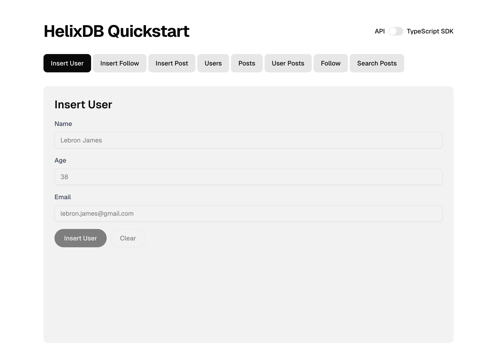

<Warning>
  Rust version 1.88.0 or higher is required. Make sure you have an updated
  version of Rust installed. Run `rustup update` to update your Rust version.
</Warning>

<Steps titleSize="h2">

  <Step title="Install HelixCLI">
    Install the HelixCLI using the following command
    ```bash
    curl -sSL https://install.helix-db.com | bash
    ```

    ### Add Helix to your PATH
    <CodeGroup>
    ```bash Unix (macOS, Linux)
    echo 'export PATH="$HOME/.local/bin:$PATH"' >> "$HOME/.zshrc"
    source ~/.zshrc
    ```

    ```bash Bash
    echo 'export PATH="$HOME/.local/bin:$PATH"' >> "$HOME/.bashrc"
    source ~/.bashrc
    ```
    </CodeGroup>

    ### Verify Installation

    To verify that HelixCLI is installed correctly

    ```bash
    helix --version
    ```

  </Step>

<Step title="Install Helix">
  Install the Helix container using the following command 
    ```bash
    helix install
    ```
</Step>

<Step title="Quick Demo Overview">
The quickstart demos showcase a social network application with the following features:

**Schema Overview:**
- **Users**: Store user profiles with name, age, email, and timestamps
- **Posts**: Store user-generated content with timestamps  
- **Relationships**: Users can follow each other (`Follows` edge) and create posts (`Created` edge)
- **Vector Search**: Posts can have embeddings for semantic search capabilities

**Key Queries In The Demo:**
- Create users, posts, and follow relationships
- Retrieve users and posts
- Find posts by specific users
- Get followers and following lists
- Create and search post embeddings for semantic similarity
</Step>

<Step title="Running a Quick Demo">
Inside the [Quickstart](https://github.com/HelixDB/quickstart) repo, there are `go`, `python`, `typescript`, `rust`, and a website demo that show you how to use the SDKs to interact with HelixDB. These demos run scripts to automatically ingest sample data into HelixDB and demonstrate how to retrieve data from HelixDB.

### Clone the Quickstart repo
```bash
git clone https://github.com/HelixDB/quickstart.git
cd quickstart
```

### Deploy the HelixDB instance for the demo
```bash
cd helixdb-cfg
helix deploy
```

**Now you can run the quickstart demo with the following SDKs or a Next.js website:**

#### Option 1: Running using Go

```bash
cd go
go run main.go
```

#### Option 2: Running using Python
using uv:
```bash
cd python
uv venv
uv sync
uv run getting_started.py
```
or with pip:
```bash
cd python
python -m venv venv
source venv/bin/activate
pip install -r requirements.txt
python getting_started.py
```

#### Option 3: Running using TypeScript
```bash
cd typescript
npm install
npm start
```

#### Option 4: Running using Rust
```bash
cd rust
cargo run
```

#### Option 5: Running the Website Demo

This demo uses Nextjs, and you can choose between the backends inside the `website_demo` folder: `rust_backend`, `python_backend`, and `go_backend` to query HelixDB or you can also send requests using Next.js as well.



```bash
cd website_demo
npm install
npm run dev
```


---

To learn more about how the SDKs work, you can check out the following guides:
- [Python SDK](../sdks/helix-py)
- [TypeScript SDK](../sdks/helix-ts)
- [Rust SDK](../sdks/helix-rs)
- [Go SDK](../sdks/helix-go)


</Step>

</Steps>    