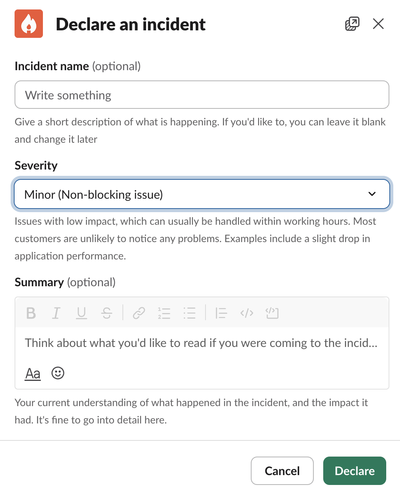
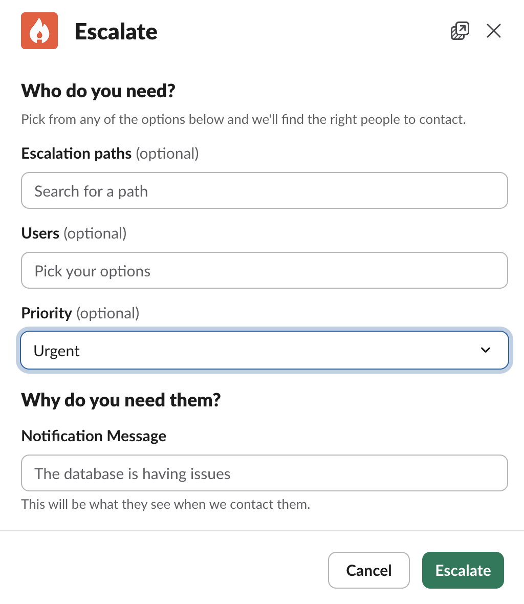

<Info>
This is for **HyperScale customers only**. By this point, a dedicated Helix Slack channel will already exist for your team. To become a HyperScale customer, [contact us directly](mailto:founders@helix-db.com).
</Info>

## How to Create an Incident

Type `/incident` in your dedicated Helix Slack channel. This opens the incident declaration form where you can describe the issue and select a severity level.

<Frame caption="Declare an incident">
  
</Frame>

## Severity Levels

### Minor — Non-blocking issue

Minor bugs or issues that are experienced but non-blocking. Simple workarounds exist. These are handled within working hours.

### Major — Blocking development

Issues that are actively blocking development. You will receive an instant response during working hours.

### Critical — Production is down

Production is down. Type `/incident escalate` in your Helix Slack channel to immediately notify the Helix team. **We are on call 24 hours to solve the problem.**

<Warning>
**Escalate critical issues immediately.** Do not wait — use `/incident escalate` as soon as production is impacted.
</Warning>

<Frame caption="Escalate an incident">
  
</Frame>
