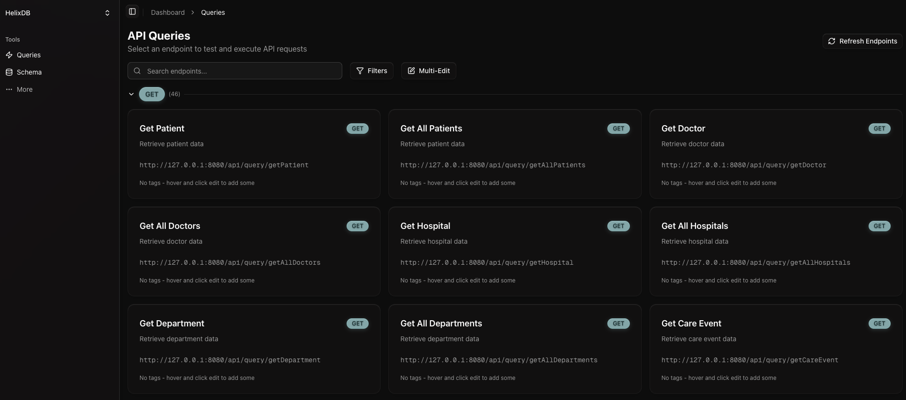
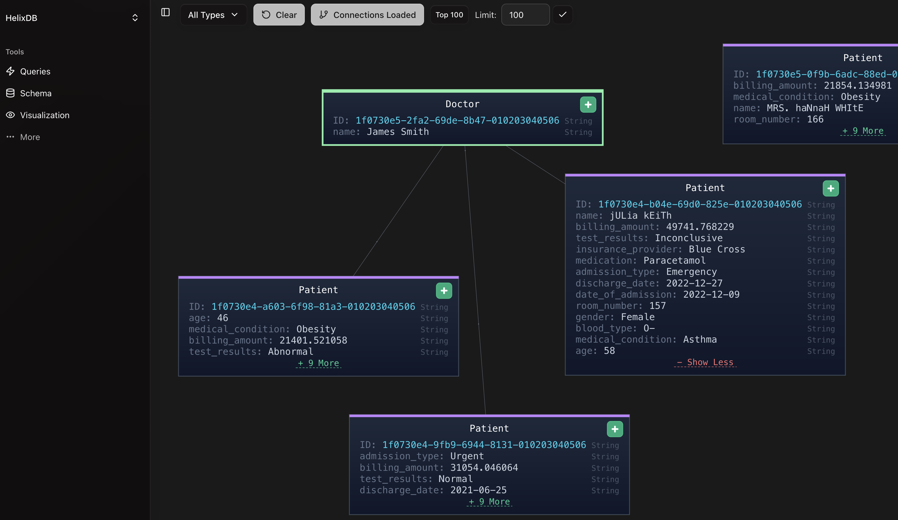

# helix-dashboard

## Overview

This is a dashboard for helixdb. It allows you to view and interact with your helixdb database.




You can access the dashboard repository [here](https://github.com/HelixDB/helix-dashboard).

## Query Format

The dashboard works best when your queries follow this naming convention:

- **Creating** or **linking** nodes and edges should start with "create" or "link" (e.g., "createPatient" or "linkPatientToDoctor")
- **Searching** or **getting** nodes and edges should start with "get" (e.g., "getPatient" or "getDoctor")
- **Updating** nodes and edges should start with "update" (e.g., "updatePatient" or "updateDoctor")
- **Deleting** nodes and edges should start with "delete" (e.g., "deletePatient" or "deleteDoctor")

## Setup

### Local Development

1. Ensure your HelixDB instance is running (default port: 6969)
2. Navigate to the `frontend` directory and run `npm install` to install dependencies
3. Run `npm run dev` to start the development server
4. The application will be available at `http://localhost:3000`

### Docker (Production)

For production deployment using Docker:

```bash
# Build and start the container
docker-compose up --build -d

# Access the application at http://localhost:3000
```

See [DOCKER_README.md](https://github.com/HelixDB/helix-dashboard/blob/5532ae55ca2764fe2dd24b087449e33a5f21fdd6/DOCKER_README.md) for detailed Docker setup instructions.

### Environment Variables

Create a `.env` file in the `frontend` directory to configure your HelixDB connection:

```bash
# Local instance
HELIX_HOST=localhost
HELIX_PORT=6969
HELIX_CLOUD_URL=
HELIX_API_KEY=

# Cloud instance  
HELIX_HOST=
HELIX_PORT=
HELIX_CLOUD_URL=https://xxxxxxxxxx.execute-api.us-west-1.amazonaws.com/v1
HELIX_API_KEY=your-api-key
```

**Available variables:**
- `HELIX_HOST` - HelixDB host (default: localhost)
- `HELIX_PORT` - HelixDB port (default: 6969)
- `HELIX_CLOUD_URL` - HelixDB cloud URL (for cloud deployments)
- `HELIX_API_KEY` - HelixDB API key (for cloud deployments)

## Visualizer Setup

**NOTE**: 
- You may need to stop your current HelixDB instance and deploy again using `helix push <instance_name>` to use the visualizer.
- In some browsers like **Brave**, you may not be able to click on all nodes properly. We recommend using Chrome, Firefox, or Safari for the best experience.
- For performance reasons, we recommend not visualizing more than **3000 nodes** as it may cause browser performance issues.

1. Ensure your HelixDB instance is deployed using `helix push <instance_name>` to use the visualizer
2. Start the dashboard application (locally or via Docker)
