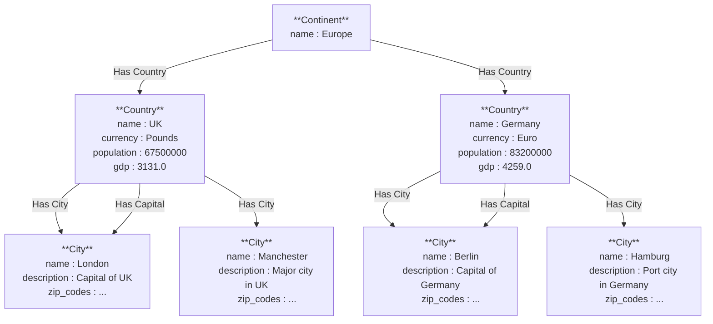

## What is Helixir?

Helixir is a Rustlings-style tutorial for HelixDB. It is a collection of exercises that will help you learn how to create a simple hierarchical HelixDB database. After completing the tutorial, you will be able to translate the concepts in this guide to your own use cases.

---

## Getting Started

**Installing Helixir**      
Install Helixir using the following command:

```bash
cargo install helixir
```

Or you can check out the [Helixir repository](https://github.com/HelixDB/helixir).


**Installing HelixDB**      
Install the HelixDB CLI using the following command:

```bash
curl -sSL https://install.helix-db.com | bash
```

**Add Helix to your PATH**

```bash
echo 'export PATH="$HOME/.local/bin:$PATH"' >> "$HOME/.zshrc"
source ~/.zshrc
```

**Install the HelixDB container using the following command:**

```bash
helix install
```

**Setup a new project**

Setup a new project using the following command:

```bash
helix init --path helixdb-cfg
```

Great, now you might have noticed that a helixdb-cfg folder appeared. In there you will start writing the schema for this tutorial.

---

## Defining Nodes

We will be using HelixDB to model the relationships between continents, countries, and cities as a graph.



First, we have to define what kind of entities/nodes will be in our graph. From the schema, we can see that we have 3 types of nodes: continents, countries, and cities.

**Node Definitions**
- The `Continent` node will have a `name` property (String)
- The `Country` node will have: `name` (String), `currency` (String), `population` (U64), and `gdp` (F64)
- The `City` node will have: `name` (String), `description` (String), and `zip_codes` (array of strings)

**Instructions:**

1. Create a `Continent` , `Country` , and `City` node with their respective properties in `schema.hx`.

<Accordion title="Answer">
```rust schema.hx
N::Continent {
    name: String
}

N::Country {
    name: String,
    currency: String,
    population: U64,
    gdp: F64
}

N::City {
    name: String,
    description: String,
    zip_codes: [String]
}
```
</Accordion>

---

## Defining Relationships

Now that we know what type of nodes are in our schema, we will define the relationships between those nodes. For this example, there is a hierarchical pattern where a city is in a country and a country is in a continent.

**Instructions:**

1. Create a `Continent_to_Country` and `Country_to_City` edge connecting their respective nodes with no properties in `schema.hx`.

<Accordion title="Answer">
```rust schema.hx
E::Continent_to_Country {
    From: Continent,
    To: Country,
    Properties: {
    }
}

E::Country_to_City {
    From: Country,
    To: City,
    Properties: {
    }
}
```
</Accordion>

---

## Meta Relationships

In addition to the structural relationships between the nodes, you can also define relationships based on metadata. For example, a country must have a capital city.

**Instructions:**

1. Create a `Country_to_Capital` edge connecting `Country` to `City` in `schema.hx` .

<Accordion title="Answer">
```rust schema.hx
E::Country_to_Capital {
    From: Country,
    To: City,
    Properties: {
    }
}
```
</Accordion>

---

## Defining Vectors

Vectors in HelixDB allow us to create vector-based searches for semantic similarity. A vector is an array of floating-point numbers that represents the semantic meaning of data. In this case, we'll create a vector for city descriptions to enable semantic search capabilities.

**Instructions:**

1. Create a `CityDescription` vector with `vector` property that takes an array of `F64`.

<Accordion title="Answer">
```rust schema.hx
V::CityDescription {
		vector: [F64]
}

E::City_to_Embedding {
		From: City,
		To: CityDescription,
		Properties: {
		}
}
```
</Accordion>

---

## Basic Node Creation

Now that we have our schema, we need to write queries to insert the data. The best way to go about this given the structure of our data is to go from top (broad) to bottom (narrow) of the hierarchy. 

First, we will start with a basic query to create a continent. Usually, creation queries almost always include all the properties of the node in the arguments. In this case, we only need to know the continent's name. Then we will use `AddN` to add a `Continent` node with property `name`. For best practices, make sure to return the continent that was added in your query.

**Instructions:**

1. Write a query to create a `Continent` node in `queries.hx`.

**Query Parameters:** 
1. `createContinent`
    - `name`: String

<Accordion title="Answer">
```rust queries.hx
QUERY createContinent (name: String) =>
    continent <- AddN<Continent>({name: name})
    RETURN continent
```
</Accordion>

---

## Relational Node Creation

Most of the nodes in our schema are related to other nodes, which means that we have to also create edges between them. However, we can optimize this process by creating both the node and the edge connecting it to other existing nodes in one query.

In this exercise, we will create a `Country` node and connect it to its corresponding `Continent` node. First we will first create a new `Country` node using `AddN`. Then we will get the `Continent` node via the node's ID so that we can create a `Continent_to_Country` edge going from the created `Continent` to `Country` node using `AddE`. We will also do the same thing for creating a `City` node.

**Instructions:**

1. Write a query to create a `Country` node and connect it to its respective `Continent` node by continent ID.

2. Write a query to create a `City` node and connect it to its respective `Country` node by country ID.

**Query Parameters:** 
1. `createCountry`
    - `continent_id`: ID
    - `name`: String
    - `currency`: String
    - `population`: I64
    - `gdp`: F64
2. `createCity`
    - `country_id`: ID
    - `name`: String
    - `description`: String

<Accordion title="Answer">
```rust queries.hx
QUERY createCountry (continent_id: ID, name: String, currency: String, population: I64, gdp: F64) =>
    country <- AddN<Country>({name: name, currency: currency, population: population, gdp: gdp})
    continent <- N<Continent>(continent_id)
    continent_country <- AddE<Continent_to_Country>()::From(continent)::To(country)
    RETURN country

QUERY createCity (country_id: ID, name: String, description: String) =>
    city <- AddN<City>({name: name, description: description})
    country <- N<Country>(country_id)
    country_city <- AddE<Country_to_City>()::From(country)::To(city)
    RETURN city
```
</Accordion>

---

## Creating Meta Relationships

In order to add meta relationships into our graph, we will connect nodes together with the edges that define the meta relationships. For this example, we will create a `Country_to_Capital` edge from a `Country` node to a `City` node.

**Instructions:**

1. Write a query to set a `City` node as the capital city of a `Country` node using their IDs.

**Query Parameters:**
1. `setCapital`
    - `country_id`: ID
    - `city_id`: ID

<Accordion title="Answer">
```rust queries.hx
QUERY setCapital (country_id: ID, city_id: ID) =>
    country <- N<Country>(country_id)
    city <- N<City>(city_id)
    country_capital <- AddE<Country_to_Capital>()::From(country)::To(city)
    RETURN country_capital
```
</Accordion>

---

## Creating Vector Embeddings

Vector embeddings allow us to perform similarity-based searches on our data. For city descriptions, this means we can find cities with similar characteristics even if they don't share exact properties. We will create a vector embedding for each city's description.

**Instructions:**

Write a query to create a `CityDescription` vector and connect it to its respective `City` node by city ID.

**Query Parameters:**
1. `embedDescription`
    - `city_id`: ID
    - `vector`: [F64]

<Accordion title="Answer">
```rust queries.hx
QUERY embedDescription (city_id: ID, vector: [F64]) =>
    embedding <- AddV<CityDescription>(vector)
    city <- N<City>(city_id)
    city_embedding <- AddE<City_to_Embedding>()::From(city)::To(embedding)
    RETURN embedding
```
</Accordion>

---

## Get Nodes by ID

Now that we know how to create nodes and their relationships, we need to be able to retrieve nodes from our graph. The simplest way is to retrieve nodes when we know their ID.

**Instructions:**

1. Write 3 queries to get `Continent` , `Country` , and `City`  by node ID.

**Query Parameters:**
1. `getContinent`
    - `continent_id`: ID
2. `getCountry`
    - `country_id`: ID
3. `getCity`
    - `city_id`: ID

<Accordion title="Answer">
```rust queries.hx
QUERY getContinent (continent_id: ID) =>
    continent <- N<Continent>(continent_id)
    RETURN continent

QUERY getCountry (country_id: ID) =>
    country <- N<Country>(country_id)
    RETURN country

QUERY getCity (city_id: ID) =>
    city <- N<City>(city_id)
    RETURN city
```
</Accordion>

---

## Get All Nodes of Type

In addition to retrieving nodes by ID, we often want to retrieve all nodes of a certain type. Since we have a hierarchical structure, we will also want to get all countries within a continent and all cities within a country. 

**Instructions:**

1. Write 3 queries to get all `Continent`, `Country`, and `City` nodes.

2. Write 2 queries to get all `Country` and `City` nodes by their parent IDs.

**Query Parameters:**
1. `getAllContinents`
2. `getAllCountries`
3. `getAllCities`
4. `getCountriesInContinent`
    - `continent_id`: ID
5. `getCitiesInCountry`
    - `country_id`: ID

<Accordion title="Answer">
```rust queries.hx
QUERY getAllContinents () =>
    continents <- N<Continent>
    RETURN continents

QUERY getAllCountries () =>
    countries <- N<Country>
    RETURN countries

QUERY getAllCities () =>
    cities <- N<City>
    RETURN cities

QUERY getCountriesInContinent (continent_id: ID) =>
    continent <- N<Continent>(continent_id)
    countries <- continent::Out<Continent_to_Country>
    RETURN countries

QUERY getCitiesInCountry (country_id: ID) =>
    country <- N<Country>(country_id)
    cities <- country::Out<Country_to_City>
    RETURN cities
```
</Accordion>

---

## Get Nodes by Meta Relationship

Similar to getting nodes by their hierarchical relationships, we can also get nodes via their meta relationships. For this example, we will retrieve the capital city of a country. We'll do this by traversing the `Country_to_Capital` edge from a `Country` node to find its capital `City` node.

**Instructions:**

1. Write a query to get a country's capital `City` node by the country's ID.

**Query Parameters:**
1. `getCapital`
    - `country_id`: ID

<Accordion title="Answer">
```rust queries.hx
QUERY getCapital (country_id: ID) =>
    country <- N<Country>(country_id)
    capital <- country::Out<Country_to_Capital>
    RETURN capital
```
</Accordion>

---

## Get Node Properties

Sometimes we don't need the full node, just a few specific properties. For example, we can display only the names and populations of countries without pulling in the entire node. In this case, we can use property selection syntax to retrieve just the fields we care about. This allows for more efficient querying and cleaner data handling when building visualizations or summaries. 

**Instructions:**

1. Write a query to get each country's `name` and `population`.

**Query Parameters:**
1. `getCountryNames`

<Accordion title="Answer">
```rust queries.hx
QUERY getCountryNames () =>
    countries <- N<Country>::{name}
    RETURN countries
```
</Accordion>

---

## Get Nodes by Property

In addition to retrieving nodes by their ID or relationship, we often need to find nodes based on their properties. This allows for more flexible querying of our graph database. We will write queries to retrieve nodes by specific properties they contain.

**Instructions:**

1. Write 3 queries that get the `Continent`, `Country`, and `City` nodes by their names.

**Query Parameters:**
1. `getContinentByName`
    - `continent_name`: String
2. `getCountryByName`
    - `country_name`: String
3. `getCityByName`
    - `city_name`: String

<Accordion title="Answer">
```rust queries.hx
QUERY getContinentByName (continent_name: String) =>
    continent <- N<Continent>::WHERE(_::{name}::EQ(continent_name))
    RETURN continent

QUERY getCountryByName (country_name: String) =>
    country <- N<Country>::WHERE(_::{name}::EQ(country_name))
    RETURN country
    
QUERY getCityByName (city_name: String) =>
    city <- N<City>::WHERE(_::{name}::EQ(city_name))
    RETURN city
```
</Accordion>

---

## Get Nodes by Property Cont.

Building on property-based queries, you can also filter nodes using comparison operators. This allows you to find nodes that meet specific criteria rather than exact matches. You'll practice with different comparison operators to filter countries by various attributes.

**Instructions:**

1. Write a query to get `Country` nodes by their currency.

2. Write a query to get `Country` nodes with population less than `max_population`.

3. Write a query to get `Country` nodes with GDP greater than or equal to `min_gdp` .

**Query Parameters:**
1. `getCountriesByCurrency`
    - `currency`: String
2. `getCountriesByPopulation`
    - `max_population`: I64
3. `getCountriesByGdp`
    - `min_gdp`: F64

<Accordion title="Answer">
```rust queries.hx
QUERY getCountriesByCurrency (currency: String) =>
    countries <- N<Country>::WHERE(_::{currency}::EQ(currency))
    RETURN countries

QUERY getCountriesByPopulation (max_population: I64) =>
    countries <- N<Country>::WHERE(_::{population}::LT(max_population))
    RETURN countries

QUERY getCountriesByGdp (min_gdp: F64) =>
    countries <- N<Country>::WHERE(_::{gdp}::GTE(min_gdp))
    RETURN countries
```
</Accordion>

---

## Get Nodes by Many Properties

Now that we've seen how to get nodes by individual properties, we can also combine multiple conditions to perform more advanced filtering. For this example, we'll write queries that retrieve `Country` nodes based on a combination of property values. This includes filtering countries with a population greater than a minimum and a GDP less than or equal to a maximum, as well as retrieving countries that either use a specific currency or have a population below a certain threshold. These types of queries allow us to refine our searches and extract more targeted subsets of data from our graph.

**Instructions:**

1. Write a query to find `Country` nodes with both population greater than `min_population` and GDP less than or equal to `max_gdp`.

2. Write a query to find `Country` nodes with either a specific `currency` or a population less than or equal to `max_population`.

**Query Parameters:**
1. `getCountriesByPopGdp`
    - `min_population`: I64
    - `max_gdp`: F64
2. `getCitiesByCurrPop`
    - `currency`: String
    - `max_population`: I64

<Accordion title="Answer">
```rust queries.hx
QUERY getCountriesByPopGdp (min_population: I64, max_gdp: F64) =>
    countries <- N<Country>::WHERE(
            AND(
                _::{population}::GT(min_population),
                _::{gdp}::LTE(max_gdp)
            )
        )
    RETURN countries

QUERY getCountriesByCurrPop (currency: String, max_population: I64) =>
    countries <- N<Country>::WHERE(
            OR(
                _::{currency}::EQ(currency),
                _::{population}::LTE(max_population)
            )
        )
    RETURN countries
```
</Accordion>

---

## Get Nodes by Meta Relationships

In addition to traversing structural relationships, we can also query nodes based on meta relationships. For example, we can retrieve all `Country` nodes that have a capital city assigned. This involves checking for the existence of an outgoing `Country_to_Capital` edge from each `Country` node. Meta relationship queries like this are useful for identifying nodes with specific contextual connections beyond hierarchical structures.

**Instructions:**

Write a query to get `Country` nodes that have capital cities.

**Query Parameters:**
1. `getCountriesWithCapitals`

<Accordion title="Answer">
```rust queries.hx
QUERY getCountriesWithCapitals () =>
    countries <- N<Country>::WHERE(EXISTS(_::Out<Country_to_Capital>))
    RETURN countries
```
</Accordion>

---

## Get Range of Nodes

When working with large datasets, it's often useful to limit the number of results returned from a query. The `RANGE` operator allows you to implement pagination and control result set size efficiently. This is particularly important for performance when dealing with queries that might return many nodes. The `RANGE` operator takes two parameters: the starting index (0-based) and the number of items to return.
            
**Instructions:**

1. Write a query to get the first `k` (`I64`) `City` nodes in a continent given the continent's name.

**Query Parameters:**
1. `getContinentCities`
    - `continent_name`: String
    - `k`: I64

<Accordion title="Answer">
```rust queries.hx
QUERY getContinentCities (continent_name: String, k: I64) =>
    continent <- N<Continent>::WHERE(_::{name}::EQ(continent_name))
    countries <- continent::Out<Continent_to_Country>
    cities <- countries::Out<Country_to_City>::RANGE(0, k)
    RETURN cities
```
</Accordion>

---

## Get Count of Nodes

In some cases, we want to gather basic statistics about our graph. For example, we can count the number of capital cities by checking how many `City` nodes have an incoming `Country_to_Capital` edge. Using the `COUNT` operation, we can quickly compute aggregate statistics like this to better understand the structure and distribution of data across our graph.

**Instructions:**

1. Write a query to get the number of capital cities.

**Query Parameters:**
1. `countCapitals`

<Accordion title="Answer">
```rust queries.hx
QUERY countCapitals () =>
    num_capital <- N<City>::WHERE(EXISTS(_::In<Country_to_Capital>))::COUNT
    RETURN num_capital
```
</Accordion>

---

## Get Nodes with Anonymous Traversals

Sometimes we want to filter nodes based other node's properties. For example, we can get all countries that have more than a certain number of cities. To do this, we'll count the number of outgoing `Country_to_City` edges from each `Country` node and filter by `num_cities`. This pattern of anonymous traversal is useful when we care about the structure or degree of connectivity in the graph, rather than the specific linked nodes themselves.

**Instructions:**

1. Write a query to get `Country` nodes that has more cities than `num_cities` .

**Query Parameters:**
1. `getCountryByCityCnt`
    - `num_cities`: I64

<Accordion title="Answer">
```rust queries.hx
QUERY getCountryByCityCnt (num_cities: I64) =>
    countries <- N<Country>::WHERE(_::Out<Country_to_City>::COUNT::GT(num_cities))
    RETURN countries
```
</Accordion>

---

## Semantic Search Vectors

Semantic search allows us to go beyond exact matches by comparing the meaning of data. For example, we can find cities with similar descriptions using vector embeddings. By searching against `CityDescription` vectors, we can retrieve the top-`k` most semantically similar `City` nodes to a given input vector. This is especially useful when we want to find cities that share common characteristics or themes, even if their properties don't match exactly.

<Info>
For Helixir, we will be using fake embeddings to test the semantic search functionality. In real applications, you would use proper embeddings from providers like OpenAI, Gemini, etc.
</Info>

**Instructions:**

1. Write a query to semantically search a `vector` against `CityDescription` vectors and returning the top `k` `City` nodes.

**Query Parameters:**
1. `searchDescriptions`
    - `vector`: [F64]
    - `k`: I64

<Accordion title="Answer">
```rust queries.hx
QUERY searchDescriptions (vector: [F64], k: I64) =>
    descriptions <- SearchV<CityDescription>(vector, k)
    cities <- descriptions::In<City_to_Embedding>
    RETURN cities
``` 
</Accordion>

---

## Updating Nodes

Updating nodes allows us to modify the properties of existing entities in our graph without needing to recreate them. To update a node, we use the `UPDATE` operation followed by the fields we want to modify. For example, we can update a country's `currency` by its `ID`, or simultaneously update both its `population` and `GDP`. Keeping node data up-to-date ensures our graph remains accurate and relevant for queries, visualizations, and downstream analytics.

**Instructions:**

1. Write a query to update a country's `currency` by a country's ID.

2. Write a query to update a country's `population` and `gdp` by a country's ID.

**Query Parameters:**
1. `updateCurrency`
    - `country_id`: ID
    - `currency`: String
2. `updatePopGdp`
    - `country_id`: ID
    - `population`: I64
    - `gdp`: F64

<Accordion title="Answer">
```rust queries.hx
QUERY updateCurrency (country_id: ID, currency: String) =>
    country <- N<Country>(country_id)::UPDATE({currency: currency})
    RETURN country
    
QUERY updatePopGdp (country_id: ID, population: I64, gdp: F64) =>
    country <- N<Country>(country_id)::UPDATE({population: population, gdp: gdp})
    RETURN country
```
</Accordion>

---

## Deleting Nodes

Deleting nodes is useful when we want to clean up outdated or incorrect data from our graph. However, this can get tricky in a graph database because not only do we have to drop the node but also the relationships connected to that node. Additionally, the order in which we drop them is very important. For example, if a city is no longer relevant or a country needs to be removed entirely, we can drop the node and its relationship to the country as a city and also potentially as a capital city. In cases where the node is linked through specific edges, like a capital city connection, it's important to remove those edges first to maintain the graph structure and allowing us to drop the other edges later. This ensures that dependent edges don't linger in the system, avoiding potential inconsistencies during traversal or analytics.

**Instructions:**

1. Write a query to delete a `City` node given its ID.

2. Write a query to delete a capital `City` node given its country's ID.

3. Write a query to delete a `Country` node given its ID.

**Query Parameters:**
1. `deleteCity`
    - `city_id`: ID
2. `deleteCapital`
    - `country_id`: ID
3. `deleteCountry`
    - `country_id`: ID

<Accordion title="Answer">
```rust queries.hx
QUERY deleteCity (city_id: ID) =>
		DROP N<City>(city_id)
		RETURN "success"
		
QUERY deleteCapital (country_id: ID) =>
		DROP N<Country<(country_id)::Out<Country_to_Capital>
		RETURN "success"

QUERY deleteCountry (country_id: ID) =>
		DROP N<Country>(country_id)::OutE<Country_to_City>
		DROP N<Country>(country_id)
		RETURN "success"
```
</Accordion>

---

## Updating Meta Relationships

Sometimes you need to update the meta relationships between nodes rather than creating new ones. For example, you might want to change which city serves as a country's capital. This involves removing the existing capital relationship and creating a new one with a different city. When updating meta relationships, it's important to properly manage the edge connections to maintain graph consistency.

**Instructions:**

1. Write a query to update the capital `City` node of a `Coutry` node given the country's ID and the new capital city's ID.

**Query Parameters:**
1. `updateCapital`
    - `country_id`: ID
    - `city_id`: ID

<Accordion title="Answer">
```rust queries.hx
QUERY updateCapital (country_id: ID, city_id: ID) =>
    DROP N<Country>(country_id)::OutE<Country_to_Capital>
    country <- N<Country>(country_id)
    city <- N<City>(city_id)
    capital <- AddE<Country_to_Capital>::From(country)::To(city)
    RETURN city
```
</Accordion>

---

## Updating Embeddings

When working with vector embeddings, you often need to update both the node properties and their associated vector embeddings. For example, when a city's description changes, you need to update the description property and also update the corresponding vector embedding to reflect the new semantic meaning. This ensures that semantic searches remain accurate and relevant.

**Instructions:**

1. Write a query to update the `description` of a `City` node given its ID and also update the `CityDescription` vector embedding given a new `vector`.

**Query Parameters:**
1. `updateDescription`
    - `city_id`: ID
    - `description`: String
    - `vector`: [F64]

<Accordion title="Answer">
```rust queries.hx
QUERY updateDescription (city_id: ID, description: String, vector: [F64]) =>
    DROP N<City>(city_id)::OutE<City_to_Embedding>
    city <- N<City>(city_id)::UPDATE({description: description})
    description_embedding <- AddV<CityDescription>(vector)
    RETURN city
```
</Accordion>

---

# Congratulations!

<h3>You've completed the Helixir guide!</h3>

In this guide, we covered the basics of querying a graph database using Helixir. We learned how to create nodes, relationships, and properties. We also learned how to filter, update, and delete nodes and their relationships.

This is just the beginning of what you can do with Helixir. There are many more features and capabilities that you can explore.

If you have any questions or feedback, please feel free to reach out to us!

## Next Steps

**Skip the Infrastructure Hassle**      
Going from local testing to production? [Helix Cloud](../helix-cloud/overview) makes it effortless. We handle servers, scaling, and maintenance so you can focus on building your application.

**Explore Use Cases**       
Ready to dive deeper? Check out our [guides and tutorials](../../guides/overview) for real-wold use cases and advanced scenarios.

**Learn the Language**      
Get to know [HelixQL](../documentation/hql/hql), our fast, efficient query language built for traversing and manipulating graph and vector data.

**Work with the SDK**       
Build, query, and embed entirely in your language of choice using our [Python SDK](../documentation/sdks/helix-py), [TypeScript SDK](../documentation/sdks/helix-ts), [Rust SDK](../documentation/sdks/helix-rs), and [Go SDK](../documentation/sdks/helix-go).

**Unlock More Features**        
Discover everything HelixDB has to offer with our cutting-edge [features](../../features/overview).