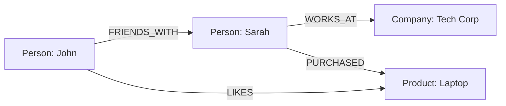

A graph database is a type of database that stores data using a graph structure, where information is represented through **nodes** (data points) and **edges** (relationships between nodes). Unlike traditional databases that use tables or documents, graph databases excel at managing highly connected data and complex relationships.

## How Graph Databases Work

Graph databases are built on two fundamental concepts:

1. **Nodes** - These are the entities or objects in your data (like people, products, or locations)
2. **Edges** (or relationships) - These are the connections between nodes that describe how they relate to each other

### Example Structure

In this simple example:
- Nodes represent people, companies, and products
- Edges show relationships like friendships, employment, and product interactions
- Both nodes and edges can have properties (additional data attributes)

## Common Use Cases

### 1. Social Networks
Perfect for modeling:
- Friend connections
- Content sharing
- User interactions
- Community detection

### 2. Recommendation Engines
Excellent for:
- Product recommendations
- Content suggestions
- "People you may know" features
- Interest-based matching

### 3. Fraud Detection
Ideal for:
- Pattern recognition in financial transactions
- Identifying suspicious relationships
- Risk assessment
- Network analysis

### 4. Knowledge Graphs
Great for:
- Semantic search
- Data integration
- AI and machine learning
- Research and discovery

## When to Use a Graph Database

Consider using a graph database when:

- Your data has many interconnected relationships
- You need to perform complex queries involving multiple relationships
- Pattern matching and path finding are important
- Traditional SQL joins become too complex or slow
- You need to model and query hierarchical structures

## Benefits Over Traditional Databases

1. **Performance**: Faster for relationship-heavy queries
2. **Flexibility**: Easier to modify and extend the data model
3. **Intuitive**: More natural way to model connected data
4. **Scalability**: Better handling of complex relationship patterns
